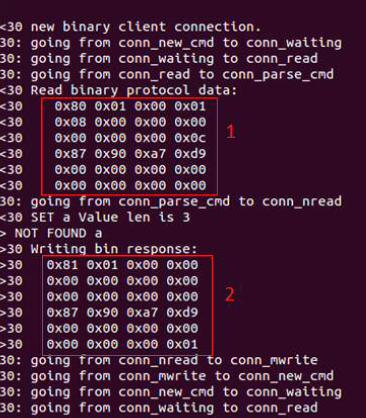

了解 Memcached 二进制协议
====

我们说,要实现 Memcached 的 GET, SET, 和 DELETE 操作。我们仅仅关注这些,但 memcached 协议有一个通用的结构,只有少数参数改变为了改变一个请求或响应的意义。这意味着您可以轻松地扩展实现添加其他命令。一般协议有 24 字节头用于请求和响应。这个头可以分解如下表14.1中。

Table 14.1 Sample Memcached header byte structure

Field | Byte offset | Value
------|------|------
Magic | 0  | 0x80 用于请求 0x81 用于响应
OpCode | 1 | 0x01...0x1A
Key length | 2 和 3 | 1...32,767
Extra length | 4 | 0x00, x04, 或 0x08
Data type | 5 | 0x00
Reserved | 6 和 7 | 0x00
Total body length | 8-11 | 所有 body 的长度
Opaque | 12-15 | 任何带带符号的 32-bit 整数; 这个也包含在响应中，因此更容易将请求映射到响应。
CAS | 16-23 | 数据版本检查

注意每个部分使用的字节数。这告诉你接下来你应该用什么数据类型。例如,如果字节的偏移量只是 byte 0,那么旧使用一个 Java byte来表示它;如果它是6和7(2字节),你使用一个Java short;如果它是 12-15(4字节),你使用一个Java int,等等。

1. 请求（只有显示头）
2. 响应

Figure 14.2 Real-world Memcached request and response headers

在图14.2中,高亮显示的第一部分代表请求打到 Memcached (只显示请求头),在这种情况下是告诉 Memcached 来 SET 键是“a”而值是“abc”。第部分是响应。

突出显示的部分中的每一行代表4个字节;因为有6行,这意味着请求头是由24个字节,正如我们之前说的。回顾表14.1中,您可以头在一个真正的请求中看到头文件中的信息。现在,这是所有你需要知道的关于 Memcached 二进制协议。在下一节中,我们需要看看多么我们可以开始制作 Netty 这些请求。

