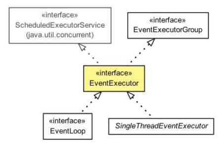

EventLoop
====

事件循环所做的正如它的名字所说的。它运行在一个循环里,直到它的终止。这符合网络框架的设计,因为他们需要在一个循环为一个特定的连接运行事件。这不是 Netty 发明新的东西;其他框架和实现已经这样做了。

下面的清单显示了典型的 EventLoop 逻辑。请注意这是为了更好的说明这个想法而不是单单展示 Netty 实现本身。

Listing 14.1 Execute task in EventLoop

	while (!terminated) {
		List<Runnable> readyEvents = blockUntilEventsReady(); //1
		for (Runnable ev: readyEvents) {
			ev.run(); //2
		}
	}

1. 阻塞直到事件可以运行
2. 循环所有事件，并运行他们

在 Netty 中使用 EventLoop 接口代表事件循环，EventLoop 是从EventExecutor 和 ScheduledExecutorService 扩展而来，所以可以将任务直接交给 EventLoop 执行。类关系图如下：

Figure 15.2 EventLoop class hierarchy

EventLoop 是完全由一个 Thread,从未改变。为了更合理利用资源,根据配置和可用的内核， Netty 可以使用多个 EventLoop。

*事件/任务执行顺序*

*一个重要的细节关于事件和任务的执行顺序是,事件/任务执行顺序按照FIFO(先进先出)。这是必要的,因为否则事件不能按顺序处理,所处理的字节将不能保证正确的顺序。这将导致问题,所以这个不是所允许的设计。*

### Netty 4 中的 I/O 和事件处理

Netty 使用 I/O 事件,b被各种 I/O 操作运输本身所触发。
这些 I/O 操作，例如网络 API 的一部分，由Java 和底层操作系统提供。

一个区别在于,一些操作(或者事件)是由 Netty 的本身的传输实现触发的，一些是由用户自己。例如读事件通常是由传输本身在读取一些数据时触发。相比之下,写事件通常是由用户本身,例如,当调用 Channel.write(…)。

究竟需要做一次处理一个事件取决于事件的性质。经常会读网络栈的数据转移到您的应用程序。有时它会在另一个方向做同样的事情,例如,把数据从应用程序到网络堆栈(内核)发送到它的远端。但不限于这种类型的事务;重要的是,所使用的逻辑是通用的,灵活地处理各种各样的用例。

I/O 和事件处理的一个重要的事情在 Netty 4,是每一个 I/O 操作和事件总是由 EventLoop 本身处理,以及分配给 EventLoop 的 Thread。

我们应该注意,Netty 不总是使用我们描述的线程模型(通过 EventLoop 抽象)。在下一节中,你会了解 Netty 3 中使用的线程模型。这将帮助你理解为什么现在用新的线程模型以及为什么使用取代了 Netty 3 中仍然使用的旧模式。

### Netty 3 中的 I/O 操作

在以前的版本中,线程模型是不同的。Netty 保证只将入站(以前称为 upstream)事件在执行 I/O Thread 执行 (I/O Thread 现在在 Netty 4 叫 EventLoop )。所有的出站(以前称为 downstream)事件被调用Thread 处理,这可能是 I/O  Thread 也可以能是其他 Thread。
这听起来像一个好主意,但原来是容易出错,因为处理 ChannelHandler需要小心的出站事件同步,因为它没有保证只有一个线程运行在同一时间。这可能会发生如果你触发 downstream 事件同时在一个管道时;例如,您 调用 Channel.write(..) 在不同的线程。

除了需要负担同步 ChannelHandler，这个线程模型的另一个问题是你可能需要去掉一个入站事件作为一个出站事件的结果，例如 Channel.write(..) 操作导致异常。在这种情况下，exceptionCaught 必须生成并抛出去。乍看之下这不像是一个问题，但我们知道， exceptionCaught 由入站事件涉及，会让你知道问题出在哪里。问题是，事实上，你现在的情况是在调用 Thread 上执行，但 exceptionCaught 事件必须交给工作线程来执行，这样上下文切换是必须的。

相比之下,Netty 4 新线程模型根本没有这些问题,因为一切都在同一个EventLoop 在同一 Thread 中 执行。这消除了需要同步ChannelHandler ,并且使它更容易为用户理解执行。

现在你知道 EventLoop 如何执行任务,它的时间来快速浏览下 Netty 的各种内部功能。

### Netty 线程模型的内部

Netty 的内部实现使其线程模型表现优异，它会检查正在执行的 Thread 是否是已分配给实际 Channel (和 EventLoop)，在 Channel 的生命周期内，EventLoop 负责处理所有的事件。

如果 Thread 是相同的 EventLoop 中的一个，讨论的代码块被执行；如果线程不同，它安排一个任务并在一个内部队列后执行。通常是通过EventLoop 的 Channel 只执行一次下一个事件，这允许直接从任何线程与通道交互，同时还确保所有的 ChannelHandler 是线程安全，不需要担心并发访问问题。

下图显示在 EventLoop 中调度任务执行逻辑，这适合 Netty 的线程模型：

1. 应在 EventLoop 中执行的任务
2. 任务传递到执行方法后,执行检查来检测调用线程是否是与分配给 EventLoop 是一样的
3. 线程是一样的,说明你在 EventLoop 里，这意味着可以直接执行的任务
4. 线程与 EventLoop 分配的不一样。当 EventLoop 事件执行时，队列的任务再次执行一次

15.5 EventLoop execution logic/flow

设计是非常重要的，以确保不要把任何长时间运行的任务放在执行队列中，因为长时间运行的任务会阻止其他在相同线程上执行的任务。这多少会影响整个系统依赖于 EventLoop 实现用于特殊传输的实现。

传输之间的切换在你的代码库中可能没有任何改变，重要的是：切勿阻塞 I/O 线程。如果你必须做阻塞调用(或执行需要长时间才能完成的任务)，使用 EventExecutor。

下一节将讲解一个在应用程序中经常使用的功能，就是调度执行任务(定期执行)。Java对这个需求提供了解决方案，但 Netty 提供了几个更好的方案

