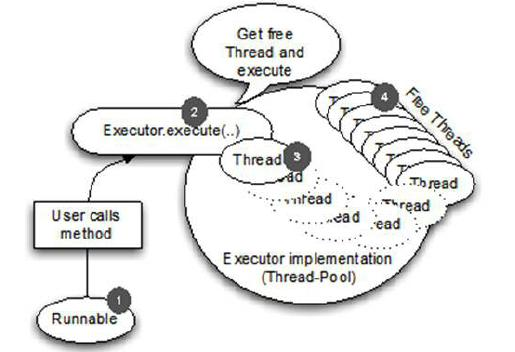

线程模型的总览
====

本节将简单介绍一般的线程模型，Netty 中如何使用指定的线程模型，以及Netty 过去不同的版本中使用的线程模型。你会更好的理解不同的线程模型的所有利弊。

一个线程模型指定代码执行,给开发人员如何执行他们代码的信息。这很重要,因为它允许开发人员事先知道如何保护他们的代码免受并发执行的副作用。若没有这个知识背景，即使是最好的开发人员都只能是碰运气,希望到最后都能这么幸运,但这几乎是不可能的。进入更多的细节之前,提供一个更好的理解主题的回顾这些天大多数应用程序做什么。

大多数现代应用程序使用多个线程调度工作,因此让应用程序使用所有可用的系统资源以有效的方式。这使得很多有意义,因为大部分硬件有不止一个甚至多个CPU核心。如果一切都只有一个 Thread 执行,不可能完全使用所提供的资源。为了解决这个问题,许多应用程序执行多个 Thread 的运行代码。在早期的 Java,这样做是通过简单地按需创建新 Thread 时,并行工作需要做。

但很快就发现,这不是完美的,因为创建 Thread 和回收会给他们带来的开销。在 Java 5 中,我们终于有了所谓的线程池,经常缓存 Thread,用来消除创建和回收 Thread 的开销。这些池由 Executor 接口提供。Java 5 提供了许多有用的实现,在其内部发生显著的变化,但思想都一脉相承的。创建 Thread 和重用他们提交一个任务时执行。这可以帮助创建和回收线程的开销降到最低。

下图显示使用一个线程池执行一个任务，提交一个任务后会使用线程池中空闲的线程来执行，完成任务后释放线程并将线程重新放回线程池：

1. Runnable 表示要执行的任务。这可能是任何东西,从一个数据库调用文件系统清理。
2. 之前 runnable 移交到线程池。
3. 闲置的线程被用来执行任务。当一个线程运行结束之后,它将回到闲置线程的列表新任务需要运行时被重用。
4. 线程执行任务

Figure 15.1 Executor execution logic

这个修复 Thread 创建和回收的开销,不需要每个新任务创建和销毁新的 Thread 。

但使用多个 Thread 提供了资源和管理成本,作为一个副作用,引入了太多的上下文切换。这种会随着运行的线程的数量和任务执行的数量的增加而恶化。尽管使用多个线程在开始时似乎不是一个问题,但一旦你把真正工作负载放在系统上，可以会遭受到重击。

除了这些技术的限制和问题,其他问题可能发生在相关的维护应用程序/框架在未来或在项目的生命周期里。有效地说,增加应用程序的复杂性取决于对比。当状态简单时,写一个多线程应用程序是一个辛苦的工作!你能解决这个问题吗?在实际的场景中需要多个 Thread 规模;这是一个事实。让我们看看 Netty 是解决这个问题。