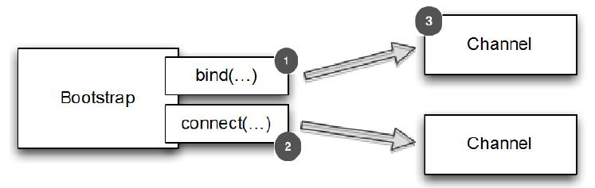

引导客户端和无连接协议
====

当需要引导客户端或一些无连接协议时，需要使用Bootstrap类。
在本节中,我们将回顾可用的各种方法引导客户端,引导线程,和可用的管道实现。

### 客户端引导方法

下表是 Bootstrap 的常用方法，其中很多是继承自 AbstractBootstrap。

Table 9.1 Bootstrap methods

名称 | 描述
-----|----
group | 设置 EventLoopGroup 用于处理所有的 Channel 的事件
channel channelFactory| channel() 指定 Channel 的实现类。如果类没有提供一个默认的构造函数,你可以调用 channelFactory() 来指定一个工厂类被 bind() 调用。
localAddress | 指定应该绑定到本地地址 Channel。如果不提供,将由操作系统创建一个随机的。或者,您可以使用 bind() 或 connect()指定localAddress 
option | 设置 ChannelOption 应用于 新创建 Channel 的 ChannelConfig。这些选项将被 bind 或 connect 设置在通道,这取决于哪个被首先调用。这个方法在创建管道后没有影响。所支持 ChannelOption 取决于使用的管道类型。请参考9.6节和 ChannelConfig 的 API 文档 的 Channel 类型使用。
attr | 这些选项将被 bind 或 connect 设置在通道,这取决于哪个被首先调用。这个方法在创建管道后没有影响。请参考9.6节。
handler | 设置添加到 ChannelPipeline 中的 ChannelHandler 接收事件通知。
clone | 创建一个当前 Bootstrap的克隆拥有原来相同的设置。
remoteAddress | 设置远程地址。此外,您可以通过 connect() 指定
connect | 连接到远端，返回一个 ChannelFuture, 用于通知连接操作完成
bind | 将通道绑定并返回一个 ChannelFuture,用于通知绑定操作完成后,必须调用 Channel.connect() 来建立连接。

### 如何引导客户端

Bootstrap 类负责创建管道给客户或应用程序，利用无连接协议和在调用 bind() 或 connect() 之后。

下图展示了如何工作

1. 当  bind() 调用时，Bootstrap 将创建一个新的管道, 当 connect() 调用在 Channel 来建立连接
2. Bootstrap 将创建一个新的管道, 当 connect() 调用时
3. 新的 Channel

Figure 9.2 Bootstrap process

下面演示了引导客户端，使用的是 NIO TCP 传输

Listing 9.1 Bootstrapping a client

	EventLoopGroup group = new NioEventLoopGroup();
	Bootstrap bootstrap = new Bootstrap(); //1
	bootstrap.group(group) //2
		.channel(NioSocketChannel.class) //3
		.handler(new SimpleChannelInboundHandler<ByteBuf>() { //4
			@Override
			protected void channeRead0(
				ChannelHandlerContext channelHandlerContext,
				ByteBuf byteBuf) throws Exception {
					System.out.println("Received data");
					byteBuf.clear();
				}
			});
	ChannelFuture future = bootstrap.connect(
		new InetSocketAddress("www.manning.com", 80)); //5
	future.addListener(new ChannelFutureListener() {
		@Override
		public void operationComplete(ChannelFuture channelFuture)
			throws Exception {
				if (channelFuture.isSuccess()) {
					System.out.println("Connection established");
				} else {
					System.err.println("Connection attempt failed");
					channelFuture.cause().printStackTrace();
				}
			}
		});

1. 创建一个新的 Bootstrap 来创建和连接到新的客户端管道
2. 指定 EventLoopGroup
3. 指定 Channel 实现来使用
4. 设置处理器给 Channel 的事件和数据
5. 连接到远端主机

注意 Bootstrap 提供了一个“流利”语法——示例中使用的方法(除了connect()) 由 Bootstrap 返回实例本身的引用链接他们。

### 兼容性

Channel 的实现和 EventLoop 的处理过程在 EventLoopGroup 中必须兼容，哪些 Channel 是和 EventLoopGroup 是兼容的可以查看 API 文档。经验显示，相兼容的实现一般在同一个包下面，例如使用NioEventLoop，NioEventLoopGroup 和 NioServerSocketChannel 在一起。请注意，这些都是前缀“Nio”，然后不会用这些代替另一个实现和另一个前缀，如“Oio”，也就是说 OioEventLoopGroup 和NioServerSocketChannel 是不相容的。

Channel 和 EventLoopGroup 的 EventLoop 必须相容，例如NioEventLoop、NioEventLoopGroup、NioServerSocketChannel是相容的，但是 OioEventLoopGroup 和 NioServerSocketChannel 是不相容的。从类名可以看出前缀是“Nio”的只能和“Nio”的一起使用。

*EventLoop 和 EventLoopGroup*

*记住,EventLoop 分配给该 Channel 负责处理 Channel 的所有操作。当你执行一个方法,该方法返回一个 ChannelFuture ，它将在 分配给 Channel 的 EventLoop 执行。*

*EventLoopGroup 包含许多 EventLoops 和分配一个 EventLoop 通道时注册。我们将在15章更详细地讨论这个话题。*

清单9.2所示的结果,试图使用一个 Channel 类型与一个 EventLoopGroup 兼容。

Listing 9.2 Bootstrap client with incompatible EventLoopGroup

	EventLoopGroup group = new NioEventLoopGroup();
	Bootstrap bootstrap = new Bootstrap(); //1
	bootstrap.group(group) //2
		.channel(OioSocketChannel.class) //3
		.handler(new SimpleChannelInboundHandler<ByteBuf>() { //4
			@Override
			protected void channelRead0(
				ChannelHandlerContext channelHandlerContext,
						ByteBuf byteBuf) throws Exception {
					System.out.println("Reveived data");
					byteBuf.clear();
				}
			});
	ChannelFuture future = bootstrap.connect(
		new InetSocketAddress("www.manning.com", 80)); //5
	future.syncUninterruptibly();

1. 创建新的 Bootstrap 来创建新的客户端管道
2. 注册 EventLoopGroup 用于获取 EventLoop
3. 指定要使用的 Channel 类。通知我们使用 NIO 版本用于
EventLoopGroup ， OIO 用于 Channel
4. 设置处理器用于管道的 I/O 事件和数据
5. 尝试连接到远端。当 NioEventLoopGroup 和  OioSocketChannel 不兼容时，会抛出 IllegalStateException 异常

IllegalStateException 显示如下：

Listing 9.3 IllegalStateException thrown because of invalid configuration

	Exception in thread "main" java.lang.IllegalStateException: incompatible event loop
	type: io.netty.channel.nio.NioEventLoop
	at
	io.netty.channel.AbstractChannel$AbstractUnsafe.register(AbstractChannel.java:5
	71)
	...

出现 IllegalStateException 的其他情况是，在 bind() 或 connect() 调用前 调用需要设置参数的方法调用失败时，包括：

* group()
* channel() 或 channnelFactory()
* handler()

handler() 方法尤为重要,因为这些 ChannelPipeline 需要适当配置。
一旦提供了这些参数,应用程序将充分利用 Netty 的能力。