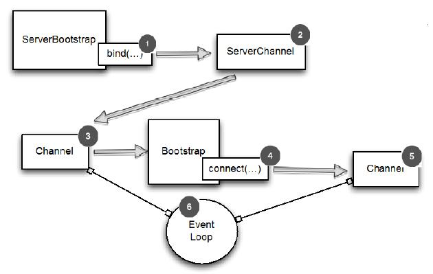

从 Channel 引导客户端
====

有时你可能需要引导客户端 Channel 从另一个 Channel。这可能发生,如果您正在编写一个代理或从其他系统需要检索数据。后一种情况是常见的,因为许多 Netty 的应用程序集成现有系统,例如 web 服务或数据库。

你当然可以创建一个新的 Bootstrap 并使用它如9.2.1节所述,这个解决方案不一定有效。至少,你需要创建另一个 EventLoop 给新客户端 Channel 的,并且  Channel 将会需要在不同的 Thread 间进行上下文切换。

幸运的是,由于 EventLoop  继承自 EventLoopGroup ,您可以通过传递 接收到的 Channel 的 EventLoop 到 Bootstrap 的 group() 方法。这允许客户端 Channel 来操作 相同的 EventLoop,这样就能消除了额外的线程创建和所有相关的上下文切换的开销。

*为什么共享 EventLoop 呢?*

*当你分享一个 EventLoop ，你保证所有 Channel 分配给 EventLoop 将使用相同的线程,消除上下文切换和相关的开销。(请记住,一个EventLoop分配给一个线程执行操作。)*

共享一个 EventLoop 描述如下：

1. 当 bind() 调用时，ServerBootstrap 创建一个新的ServerChannel 。 当绑定成功后，这个管道就能接收子管道了
2. ServerChannel 接收新连接并且创建子管道来服务它们
3. Channel 用于接收到的连接
4. 管道自己创建了 Bootstrap，用于当 connect() 调用时创建一个新的管道
5. 新管道连接到远端
6. 在 EventLoop 接收通过 connect() 创建后就在管道间共享

Figure 9.4 EventLoop shared between channels with ServerBootstrap and Bootstrap

实现 EventLoop 共享，包括设置 EventLoop 引导通过Bootstrap.eventLoop() 方法。这是清单9.5所示。

	ServerBootstrap bootstrap = new ServerBootstrap(); //1
	bootstrap.group(new NioEventLoopGroup(), //2
		new NioEventLoopGroup()).channel(NioServerSocketChannel.class) //3
	        .childHandler(		//4
				new SimpleChannelInboundHandler<ByteBuf>() {
	            ChannelFuture connectFuture;
	
	            @Override
	            public void channelActive(ChannelHandlerContext ctx) throws Exception {
	                Bootstrap bootstrap = new Bootstrap();//5
	                bootstrap.channel(NioSocketChannel.class) //6
	                        .handler(new SimpleChannelInboundHandler<ByteBuf>() {  //7
	                            @Override
	                            protected void channelRead0(ChannelHandlerContext ctx, ByteBuf in) throws Exception {
	                                System.out.println("Reveived data");
	                            }
	                        });
	                bootstrap.group(ctx.channel().eventLoop()); //8
	                connectFuture = bootstrap.connect(new InetSocketAddress("www.manning.com", 80));  //9
	            }
	
	            @Override
	            protected void channelRead0(ChannelHandlerContext channelHandlerContext, ByteBuf byteBuf) throws Exception {
	                if (connectFuture.isDone()) {
	                    // do something with the data  //10
	                }
	            }
	        });
	ChannelFuture future = bootstrap.bind(new InetSocketAddress(8080));  //11
	future.addListener(new ChannelFutureListener() {
	    @Override
	    public void operationComplete(ChannelFuture channelFuture) throws Exception {
	        if (channelFuture.isSuccess()) {
	            System.out.println("Server bound");
	        } else {
	            System.err.println("Bound attempt failed");
	            channelFuture.cause().printStackTrace();
	        }
	    }
	});

1. 创建一个新的 ServerBootstrap 来创建新的 SocketChannel 管道并且绑定他们
2. 指定 EventLoopGroups 从 ServerChannel 和接收到的管道来注册并获取 EventLoops 
3. 指定 Channel 类来使用
4. 设置处理器用于处理接收到的管道的 I/O 和数据
5. 创建一个新的 Bootstrap 来连接到远程主机
6. 设置管道类
7. 设置处理器来处理 I/O
8. 使用相同的 EventLoop 作为分配到接收的管道
9. 连接到远端
10. 连接完成处理业务逻辑 (比如, proxy)
11. 通过配置了的 Bootstrap 来绑定到管道

注意，新的 EventLoop 会创建一个新的 Thread。出于该原因，EventLoop 实例应该尽量重用。或者限制实例的数量来避免耗尽系统资源。