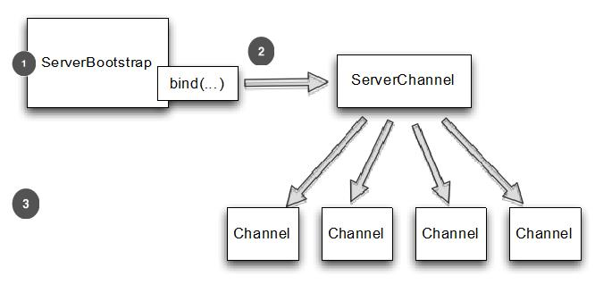

引导服务器
====

服务器的引导共用了客户端引导的一些逻辑。

### 引导服务器的方法

下表显示了 ServerBootstrap 的方法

Table 9.2 Methods of ServerBootstrap‘

名称 | 描述
-----|----
group | 设置 EventLoopGroup 用于 ServerBootstrap。这个 EventLoopGroup 提供 ServerChannel 的  I/O 并且接收 Channel
channel channelFactory | channel() 指定 Channel 的实现类。如果管道没有提供一个默认的构造函数,你可以提供一个 ChannelFactory。
localAddress | 指定 ServerChannel 实例化的类。如果不提供,将由操作系统创建一个随机的。或者,您可以使用 bind() 或 connect()指定localAddress
option | 指定一个 ChannelOption 来用于新创建的 ServerChannel 的 ChannelConfig 。这些选项将被设置在管道的 bind() 或 connect(),这取决于谁首先被调用。在此调用这些方法之后设置或更改 ChannelOption 是无效的。所支持 ChannelOption 取决于使用的管道类型。请参考9.6节和 ChannelConfig 的 API 文档 的 Channel 类型使用。
childOption | 当管道已被接受，指定一个 ChannelOption 应用于 Channel 的 ChannelConfig。
attr | 指定 ServerChannel 的属性。这些属性可以被 管道的 bind()   设置。当调用 bind() 之后，修改它们不会生效。
childAttr | 应用属性到接收到的管道上。后续调用没有效果。
handler | 设置添加到 ServerChannel 的 ChannelPipeline 中的 ChannelHandler。 具体详见 childHandler() 描述
childHandler | 设置添加到接收到的 Channel 的 ChannelPipeline 中的 ChannelHandler。handler() 和 childHandler()之间的区别是前者是接收和处理ServerChannel，同时 childHandler() 添加处理器用于处理和接收 Channel。后者代表一个套接字绑定到一个远端。
clone | 克隆 ServerBootstrap 用于连接到不同的远端，通过设置相同的原始 ServerBoostrap。
bind | 绑定 ServerChannel 并且返回一个 ChannelFuture,用于 通知连接操作完成了（结果可以是成功或者失败）

### 如何引导一个服务器

ServerBootstrap 中的 childHandler(), childAttr() 和 childOption() 是常用的服务器应用的操作。具体来说,ServerChannel实现负责创建子 Channel,它代表接受连接。因此 引导 ServerChannel 的 ServerBootstrap ,提供这些方法来简化接收的 Channel 对 ChannelConfig 应用设置的任务。

图9.3显示了 ServerChannel 创建 ServerBootstrap 在 bind(),后者管理大量的子 Channel。

1. 当调用 bind() 后 ServerBootstrap 将创建一个新的管道，这个管道将会在绑定成功后接收子管道
2. 接收新连接给每个子管道
3. 接收连接的 Channel 

Figure 9.3 ServerBootstrap

记住 child* 的方法都是操作在子的 Channel，被 ServerChannel 管理。

清单9.4 ServerBootstrap 时会创建一个 NioServerSocketChannel实例 bind() 。这个 NioServerChannel 负责接受新连接和创建NioSocketChannel 实例。

Listing 9.4 Bootstrapping a server

	NioEventLoopGroup group = new NioEventLoopGroup();
	ServerBootstrap bootstrap = new ServerBootstrap(); //1
	bootstrap.group(group) //2
		.channel(NioServerSocketChannel.class) //3
		.childHandler(new SimpleChannelInboundHandler<ByteBuf>() { //4
			@Override
			protected void channelRead0(ChannelHandlerContext ctx,
				ByteBuf byteBuf) throws Exception {
					System.out.println("Reveived data");
					byteBuf.clear();
				}
			}
		);
	ChannelFuture future = bootstrap.bind(new InetSocketAddress(8080)); //5
	future.addListener(new ChannelFutureListener() {
		@Override
		public void operationComplete(ChannelFuture channelFuture)
			throws Exception {
				if (channelFuture.isSuccess()) {
					System.out.println("Server bound");
				} else {
					System.err.println("Bound attempt failed");
					channelFuture.cause().printStackTrace();
				}
			}
		}
	);

1. 创建要给新的 ServerBootstrap 来创建新的 SocketChannel 管道并绑定他们
2. 指定 EventLoopGroup  用于从注册的 ServerChannel 中获取EventLoop 和接收到的管道
3. 指定要使用的管道类
4. 设置子处理器用于处理接收的管道的 I/O 和数据
5. 通过配置引导来绑定管道