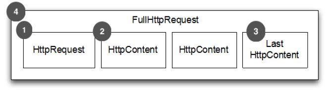
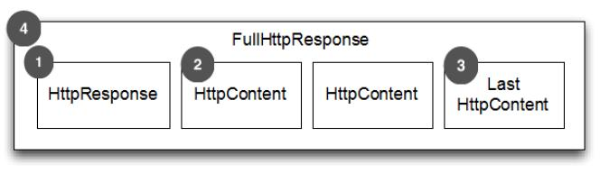
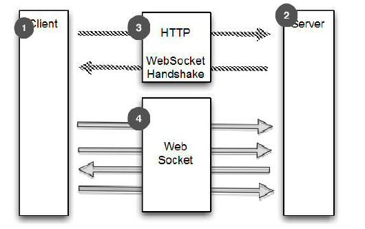

构建 Netty HTTP/HTTPS 应用
====

HTTP/HTTPS 是最常见的一种协议，在智能手机里广泛应用。虽然每家公司都有一个主页,您可以通过HTTP或HTTPS访问,这不是它唯一的使用。许多组织通过 HTTP(S) 公开 WebService API ,旨在用于缓解独立的平台带来的弊端
。
让我们看一下 Netty 提供的 ChannelHandler,是如何允许您使用 HTTP 和 HTTPS 而无需编写自己的编解码器。

### HTTP Decoder, Encoder 和 Codec

HTTP 是请求-响应模式，客户端发送一个 HTTP 请求，服务就响应此请求。Netty 提供了简单的编码、解码器来简化基于这个协议的开发工作。图8.2和图8.3显示 HTTP 请求和响应的方法是如何生产和消费的

1. HTTP Request 第一部分是包含的头信息
2. HttpContent 里面包含的是数据，可以后续有多个 HttpContent 部分
3. LastHttpContent 标记是 HTTP request 的结束，同时可能包含头的尾部信息
4. 完整的 HTTP request

Figure 8.2 HTTP request component parts

1. HTTP response 第一部分是包含的头信息
2. HttpContent 里面包含的是数据，可以后续有多个 HttpContent 部分
3. LastHttpContent 标记是 HTTP response 的结束，同时可能包含头的尾部信息
4. 完整的 HTTP response

Figure 8.3 HTTP response component parts

如图8.2和8.3所示的 HTTP 请求/响应可能包含不止一个数据部分,它总是终止于 LastHttpContent 部分。FullHttpRequest 和FullHttpResponse 消息是特殊子类型,分别表示一个完整的请求和响应。所有类型的 HTTP 消息(FullHttpRequest ，LastHttpContent 以及那些如清单8.2所示)实现 HttpObject 接口。

表8.2概述 HTTP 解码器和编码器的处理和生产这些消息。

Table 8.2 HTTP decoder and encoder

名称 | 描述
-----|----
HttpRequestEncoder |Encodes HttpRequest , HttpContent and LastHttpContent messages to bytes.
HttpResponseEncoder | Encodes HttpResponse, HttpContent and LastHttpContent messages to bytes.
HttpRequestDecoder | Decodes bytes into HttpRequest, HttpContent and LastHttpContent messages.
HttpResponseDecoder | Decodes bytes into HttpResponse, HttpContent and LastHttpContent messages.

清单8.2所示的是将支持 HTTP 添加到您的应用程序是多么简单。仅仅添加正确的 ChannelHandler 到 ChannelPipeline 中

Listing 8.2 Add support for HTTP

	public class HttpPipelineInitializer extends ChannelInitializer<Channel> {
	
	    private final boolean client;
	
	    public HttpPipelineInitializer(boolean client) {
	        this.client = client;
	    }
	
	    @Override
	    protected void initChannel(Channel ch) throws Exception {
	        ChannelPipeline pipeline = ch.pipeline();
	        if (client) {
	            pipeline.addLast("decoder", new HttpResponseDecoder());  //1
	            pipeline.addLast("encoder", new HttpRequestEncoder());  //2
	        } else {
	            pipeline.addLast("decoder", new HttpRequestDecoder());  //3
	            pipeline.addLast("encoder", new HttpResponseEncoder());  //4
	        }
	    }
	}

1. client: 添加 HttpResponseDecoder 用于处理来自 server 响应
2. client: 添加 HttpRequestEncoder 用于发送请求到 server
3. server: 添加 HttpRequestDecoder 用于接收来自 client 的请求
4. server: 添加 HttpResponseEncoder 用来发送响应给 client

### HTTP消息聚合

安装 ChannelPipeline 中的初始化之后,你能够对不同 HttpObject 消息进行操作。但由于 HTTP 请求和响应可以由许多部分组合而成，你需要聚合他们形成完整的消息。为了消除这种繁琐任务， Netty 提供了一个聚合器,合并消息部件到 FullHttpRequest 和 FullHttpResponse 消息。这样您总是能够看到完整的消息内容。

这个操作有一个轻微的成本,消息段需要缓冲,直到完全可以将消息转发到下一个 ChannelInboundHandler 管道。但好处是,你不必担心消息碎片。

实现自动聚合只需添加另一个 ChannelHandler 到 ChannelPipeline。清单8.3显示了这是如何实现的。

Listing 8.3 Automatically aggregate HTTP message fragments

	public class HttpAggregatorInitializer extends ChannelInitializer<Channel> {
	
	    private final boolean client;
	
	    public HttpAggregatorInitializer(boolean client) {
	        this.client = client;
	    }
	
	    @Override
	    protected void initChannel(Channel ch) throws Exception {
	        ChannelPipeline pipeline = ch.pipeline();
	        if (client) {
	            pipeline.addLast("codec", new HttpClientCodec());  //1
	        } else {
	            pipeline.addLast("codec", new HttpServerCodec());  //2
	        }
	        pipeline.addLast("aggegator", new HttpObjectAggregator(512 * 1024));  //3
	    }
	}

1. client: 添加 HttpClientCodec
2. server: 添加 HttpServerCodec 作为我们是 server 模式时
3. 添加 HttpObjectAggregator 到 ChannelPipeline, 使用最大消息值是 512kb

### HTTP 压缩

使用 HTTP 时建议压缩数据以减少传输流量，压缩数据会增加 CPU 负载，现在的硬件设施都很强大，大多数时候压缩数据时一个好主意。Netty 支持“gzip”和“deflate”，为此提供了两个 ChannelHandler 实现分别用于压缩和解压。看下面代码：

#### HTTP Request Header

客户端可以通过提供下面的头显示支持加密模式。然而服务器不是,所以不得不压缩它发送的数据。

	GET /encrypted-area HTTP/1.1
	Host: www.example.com
	Accept-Encoding: gzip, deflate

下面是一个例子

Listing 8.4 Automatically compress HTTP messages

	public class HttpAggregatorInitializer extends ChannelInitializer<Channel> {
	
		private final boolean isClient;
		public HttpAggregatorInitializer(boolean isClient) {
			this.isClient = isClient;
		}
		@Override
		protected void initChannel(Channel ch) throws Exception {
			ChannelPipeline pipeline = ch.pipeline();
			if (isClient) {
				pipeline.addLast("codec", new HttpClientCodec()); //1
				pipeline.addLast("decompressor",new HttpContentDecompressor()); //2
			} else {
				pipeline.addLast("codec", new HttpServerCodec()); //3
				pipeline.addLast("compressor",new HttpContentCompressor()); //4
			}
		}
	}

1. client: 添加 HttpClientCodec
2. client: 添加 HttpContentDecompressor 用于处理来自服务器的压缩的内容
3. server: HttpServerCodec
4. server: HttpContentCompressor 用于压缩来自 client  支持的  HttpContentCompressor

*压缩与依赖*

*注意，Java 6或者更早版本，如果要压缩数据，需要添加 [jzlib](http://www.jcraft.com/jzlib/) 到 classpath*

	<dependency>
		<groupId>com.jcraft</groupId>
			<artifactId>jzlib</artifactId>
		<version>1.1.3</version>
	</dependency>

### 使用 HTTPS 

启用 HTTPS，只需添加 SslHandler

Listing 8.5 Using HTTPS

	public class HttpsCodecInitializer extends ChannelInitializer<Channel> {
	
	    private final SslContext context;
	    private final boolean client;
	
	    public HttpsCodecInitializer(SslContext context, boolean client) {
	        this.context = context;
	        this.client = client;
	    }
	
	    @Override
	    protected void initChannel(Channel ch) throws Exception {
	        ChannelPipeline pipeline = ch.pipeline();
	        SSLEngine engine = context.newEngine(ch.alloc());
	        pipeline.addFirst("ssl", new SslHandler(engine));  //1
	
	        if (client) {
	            pipeline.addLast("codec", new HttpClientCodec());  //2
	        } else {
	            pipeline.addLast("codec", new HttpServerCodec());  //3
	        }
	    }
	}

1. 添加 SslHandler 到 pipeline 来启用  HTTPS
2. client: 添加 HttpClientCodec
3. server: 添加 HttpServerCodec ，如果是 server 模式的话

上面的代码就是一个很好的例子，解释了 Netty 的架构是如何让“重用”变成了“杠杆”。我们可以添加一个新的功能,甚至是一样重要的加密支持,几乎没有工作量,只需添加一个ChannelHandler 到 ChannelPipeline。

### WebSocket 

HTTP 是不错的协议，但是如果需要实时发布信息怎么做？有个做法就是客户端一直轮询请求服务器，这种方式虽然可以达到目的，但是其缺点很多，也不是优秀的解决方案，为了解决这个问题，便出现了 WebSocket。
        
WebSocket 允许数据双向传输，而不需要请求-响应模式。早期的WebSocket 只能发送文本数据，然后现在不仅可以发送文本数据，也可以发送二进制数据，这使得可以使用 WebSocket 构建你想要的程序。下图是WebSocket 的通信示例图：

WebSocket 规范及其实现是为了一个更有效的解决方案。简单的说,
一个WebSocket 提供一个 TCP 连接两个方向的交通。结合 WebSocket API 它提供了一个替代 HTTP 轮询双向通信从页面到远程服务器。

也就是说,WebSocket 提供真正的双向客户机和服务器之间的数据交换。
我们不会对内部太多的细节,但我们应该提到,虽然最早实现仅限于文本数据，但现在不再是这样,WebSocket可以用于任意数据,就像一个正常的套接字。

图8.4给出了一个通用的 WebSocket 协议。在这种情况下的通信开始于普通 HTTP ，并“升级”为双向 WebSocket。

1. Client (HTTP) 与 Server 通讯
2. Server (HTTP) 与 Client 通讯
3. Client 通过 HTTP(s) 来进行 WebSocket 握手,并等待确认
4. 连接协议升级至 WebSocket

Figure 8.4 WebSocket protocol

添加应用程序支持 WebSocket 只需要添加适当的客户端或服务器端WebSocket ChannelHandler 到管道。这个类将处理特殊 WebSocket 定义的消息类型,称为“帧。“如表8.3所示,这些可以归类为“数据”和“控制”帧。

Table 8.3 WebSocketFrame types

名称 | 描述
-----|----
BinaryWebSocketFrame | Data frame: binary data
TextWebSocketFrame | Data frame: text data
ContinuationWebSocketFrame | Data frame: text or binary data that belongs to a previous BinaryWebSocketFrame or TextWebSocketFrame
CloseWebSocketFrame | Control frame: a CLOSE request, close status code and a phrase
PingWebSocketFrame | Control frame: requests the send of a PongWebSocketFrame
PongWebSocketFrame | Control frame: sent as response to a PingWebSocketFrame

由于 Netty 的主要是一个服务器端技术重点在这里创建一个 WebSocket server 。清单8.6使用 WebSocketServerProtocolHandler 提出了一个简单的例子。该类处理协议升级握手以及三个“控制”帧 Close, Ping 和 Pong。Text 和 Binary 数据帧将被传递到下一个处理程序(由你实现)进行处理。

Listing 8.6 Support WebSocket on the server

	public class WebSocketServerInitializer extends ChannelInitializer<Channel> {
	    @Override
	    protected void initChannel(Channel ch) throws Exception {
	        ch.pipeline().addLast(
	                new HttpServerCodec(),
	                new HttpObjectAggregator(65536),  //1
	                new WebSocketServerProtocolHandler("/websocket"),  //2
	                new TextFrameHandler(),  //3
	                new BinaryFrameHandler(),  //4
	                new ContinuationFrameHandler());  //5
	    }
	
	    public static final class TextFrameHandler extends SimpleChannelInboundHandler<TextWebSocketFrame> {
	        @Override
	        public void channelRead0(ChannelHandlerContext ctx, TextWebSocketFrame msg) throws Exception {
	            // Handle text frame
	        }
	    }
	
	    public static final class BinaryFrameHandler extends SimpleChannelInboundHandler<BinaryWebSocketFrame> {
	        @Override
	        public void channelRead0(ChannelHandlerContext ctx, BinaryWebSocketFrame msg) throws Exception {
	            // Handle binary frame
	        }
	    }
	
	    public static final class ContinuationFrameHandler extends SimpleChannelInboundHandler<ContinuationWebSocketFrame> {
	        @Override
	        public void channelRead0(ChannelHandlerContext ctx, ContinuationWebSocketFrame msg) throws Exception {
	            // Handle continuation frame
	        }
	    }
	}

1. 添加 HttpObjectAggregator 用于提供在握手时聚合 HttpRequest
2. 添加 WebSocketServerProtocolHandler 用于处理色好给你寄握手如果请求是发送到"/websocket." 端点，当升级完成后，它将会处理Ping, Pong 和 Close 帧
3. TextFrameHandler 将会处理 TextWebSocketFrames
4. BinaryFrameHandler 将会处理 BinaryWebSocketFrames
5. ContinuationFrameHandler 将会处理ContinuationWebSocketFrames

*加密 WebSocket*
*只需插入 SslHandler 到作为 pipline 第一个 ChannelHandler*

详见 [Chapter 11 WebSocket](../NETTY BY EXAMPLE/WebSockets.md)

### SPDY 

[SPDY](http://www.chromium.org/spdy)（读作“SPeeDY”）是Google 开发的基于 TCP 的应用层协议，用以最小化网络延迟，提升网络速度，优化用户的网络使用体验。SPDY 并不是一种用于替代 HTTP 的协议，而是对 HTTP 协议的增强。SPDY 实现技术：

* 压缩报头
* 加密所有
* 多路复用连接
* 提供支持不同的传输优先级

SPDY 主要有5个版本：

* 1 - 初始化版本，但没有使用
* 2 - 新特性，包含服务器推送
* 3 - 新特性包含流控制和更新压缩
* 3.1 - 会话层流程控制
* 4.0 - 流量控制，并与 HTTP 2.0 更加集成

SPDY 被很多浏览器支持，包括  Google Chrome, Firefox, 和 Opera

Netty 支持 版本 2 和 3 （包含3.1）的支持。这些版本被广泛应用，可以支持更多的用户。更多内容详见 [Chapter 12](../NETTY BY EXAMPLE/SPDY.md)
