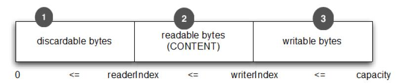
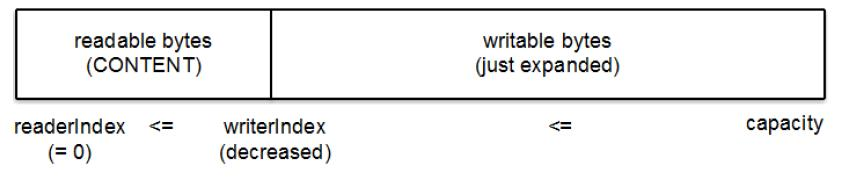
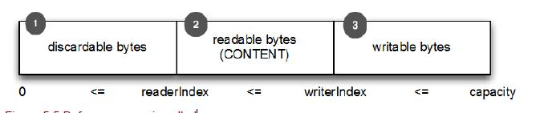
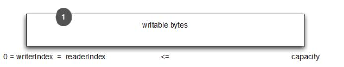

字节级别的操作
====

除了基本的读写操作， ByteBuf 还提供了它所包含的数据的修改方法。

###随机访问索引

ByteBuf 使用zero-based 的 indexing(从0开始的索引)，第一个字节的索引是 0，最后一个字节的索引是 ByteBuf 的 capacity - 1，下面代码是遍历 ByteBuf 的所有字节：

Listing 5.6 Access data

	ByteBuf buffer = ...;
    for (int i = 0; i < buffer.capacity(); i++) {
        byte b = buffer.getByte(i);
        System.out.println((char) b);
    }
 
注意通过索引访问时不会推进 readerIndex （读索引）和 writerIndex（写索引），我们可以通过 ByteBuf 的 readerIndex(index) 或 writerIndex(index) 来分别推进读索引或写索引

顺序访问索引
        
ByteBuf 提供两个指针变量支付读和写操作，读操作是使用 readerIndex()，写操作时使用 writerIndex()。这和JDK的ByteBuffer不同，ByteBuffer只有一个方法来设置索引，所以需要使用 flip() 方法来切换读和写模式。
        
ByteBuf 一定符合：0 <= readerIndex <= writerIndex <= capacity。

Figure 5.3 ByteBuf internal segmentation

1.字节，可以被丢弃，因为它们已经被读

2.还没有被读的字节是：“readable bytes（可读字节）”

3.空间可加入多个字节的是：“writeable bytes（写字节）”

###可丢弃字节的字节

标有“可丢弃字节”的段包含已经被读取的字节。他们可以被丢弃，通过调用discardReadBytes() 来回收空间。这个段的初始大小存储在readerIndex，为 0，当“read”操作被执行时递增（“get”操作不会移动 readerIndex）。

图5.4示出了在 图5.3 中的缓冲区中调用 discardReadBytes() 所示的结果。你可以看到，在丢弃字节段的空间已变得可用写。需要注意的是不能保证对可写的段之后的内容在 discardReadBytes() 方法之后已经被调用。

Figure 5.4 ByteBuf after discarding read bytes.

1.字节尚未被读出（readerIndex 现在 0）。
2.可用的空间，由于空间被回收而增大。

ByteBuf.discardReadBytes() 可以用来清空 ByteBuf 中已读取的数据，从而使 ByteBuf 有多余的空间容纳新的数据，但是discardReadBytes() 可能会涉及内存复制，因为它需要移动 ByteBuf 中可读的字节到开始位置，这样的操作会影响性能，一般在需要马上释放内存的时候使用收益会比较大。
 
###可读字节

ByteBuf 的“可读字节”分段存储的是实际数据。新分配，包装，或复制的缓冲区的 readerIndex 的默认值为 0 。任何操作，其名称以 "read" 或 "skip" 开头的都将检索或跳过该数据在当前 readerIndex ，并且通过读取的字节数来递增。

如果所谓的读操作是一个指定 ByteBuf 参数作为写入的对象，并且没有一个目标索引参数，目标缓冲区的 writerIndex 也会增加了。例如：

	readBytes(ByteBuf dest);

如果试图从缓冲器读取已经用尽的可读的字节，则抛出IndexOutOfBoundsException。清单5.8显示了如何读取所有可读字节。

Listing 5.7 Read all data

	//遍历缓冲区的可读字节
	ByteBuf buffer= ...;
    while (buffer.isReadable()) {
        System.out.println(buffer.readByte());
    }

这段是未定义内容的地方，准备好写。一个新分配的缓冲区的 writerIndex 的默认值是 0 。任何操作，其名称 "write"开头的操作在当前的 writerIndex 写入数据时，递增字节写入的数量。如果写操作的目标也是 ByteBuf ，且未指定源索引，则源缓冲区的 readerIndex 将增加相同的量。例如：

	writeBytes(ByteBuf dest);

如果试图写入超出目标的容量，则抛出 IndexOutOfBoundException。

下面的例子展示了填充随机整数到缓冲区中，直到耗尽空间。该方法writableBytes() 被用在这里确定是否存在足够的缓冲空间。

	
Listing 5.8 Write data

	//填充随机整数到缓冲区中
	ByteBuf buffer = ...;
    while (buffer.writableBytes() >= 4) {
        buffer.writeInt(random.nextInt());
    }

###索引管理

在 JDK 的 InputStream 定义了 mark(int readlimit) 和 reset()方法。这些是分别用来标记流中的当前位置和复位流到该位置。

同样，您可以设置和重新定位ByteBuf readerIndex 和 writerIndex 通过调用 markReaderIndex(), markWriterIndex(), resetReaderIndex() 和 resetWriterIndex()。这些类似于InputStream 的调用，所不同的是，没有 readlimit 参数来指定当标志变为无效。

您也可以通过调用 readerIndex(int) 或 writerIndex(int) 将指标移动到指定的位置。在尝试任何无效位置上设置一个索引将导致 IndexOutOfBoundsException 异常。

调用 clear() 可以同时设置 readerIndex 和 writerIndex 为 0。注意，这不会清除内存中的内容。让我们看看它是如何工作的。 （图5.5图重复5.3 ）

Figure 5.5 Before clear() is called

调用之前，包含3个段，下面显示了调用之后

Figure 5.6 After clear() is called

现在 整个 ByteBuf 空间都是可写的了。

clear() 比 discardReadBytes() 更低成本，因为他只是重置了索引，而没有内存拷贝。

###查询操作

有几种方法，以确定在所述缓冲器中的指定值的索引。最简单的是使用 indexOf() 方法。更复杂的搜索执行以 ByteBufProcessor 为参数的方法。这个接口定义了一个方法，boolean process(byte value)，它用来报告输入值是否是一个正在寻求的值。

ByteBufProcessor 定义了很多方便实现共同目标值。例如，假设您的应用程序需要集成所谓的“[Flash sockets](http://help.adobe.com/en_US/as3/dev/WSb2ba3b1aad8a27b0-181c51321220efd9d1c-8000.html)”，将使用 NULL 结尾的内容。调用

	forEachByte（ByteBufProcessor.FIND_NUL）

通过减少的，因为少量的
“边界检查”的处理过程中执行了，从而使 消耗 Flash 数据变得 编码工作量更少、效率更高。

下面例子展示了寻找一个回车符，`\ r`的一个例子。

Listing 5.9 Using ByteBufProcessor to find `\r`

	ByteBuf buffer = ...;
    int index = buffer.forEachByte(ByteBufProcessor.FIND_CR);

###衍生的缓冲区

“衍生的缓冲区”是代表一个专门的展示 ByteBuf 内容的“视图”。这种视图是由 duplicate(), slice(), slice(int, int),readOnly(), 和 order(ByteOrder) 方法创建的。所有这些都返回一个新的 ByteBuf 实例包括它自己的 reader, writer 和标记索引。然而，内部数据存储共享就像在一个 NIO 的 ByteBuffer。这使得衍生的缓冲区创建、修改其
内容，以及修改其“源”实例更廉价。

*ByteBuf 拷贝*

*如果需要已有的缓冲区的全新副本，使用 copy() 或者 copy(int, int)。不同于派生缓冲区，这个调用返回的 ByteBuf 有数据的独立副本。*

若需要操作某段数据，使用 slice(int, int)，下面展示了用法：

Listing 5.10 Slice a ByteBuf

    Charset utf8 = Charset.forName("UTF-8");
    ByteBuf buf = Unpooled.copiedBuffer("Netty in Action rocks!", utf8); //1

    ByteBuf sliced = buf.slice(0, 14);          //2
    System.out.println(sliced.toString(utf8));  //3

    buf.setByte(0, (byte) 'J');                 //4
    assert buf.getByte(0) == sliced.getByte(0);

1.创建一个 ByteBuf 保存特定字节串。

2.创建从索引 0 开始，并在 14 结束的 ByteBuf 的新 slice。

3.打印 Netty in Action

4.更新索引 0 的字节。

5.断言成功，因为数据是共享的，并以一个地方所做的修改将在其他地方可见。

下面看下如何将一个 ByteBuf 段的副本不同于 slice。

Listing 5.11 Copying a ByteBuf

    Charset utf8 = Charset.forName("UTF-8");
    ByteBuf buf = Unpooled.copiedBuffer("Netty in Action rocks!", utf8);     //1

    ByteBuf copy = buf.copy(0, 14);               //2
    System.out.println(copy.toString(utf8));      //3

    buf.setByte(0, (byte) 'J');                   //4
    assert buf.getByte(0) != copy.getByte(0);

1.创建一个 ByteBuf 保存特定字节串。

2.创建从索引0开始和 14 结束 的 ByteBuf 的段的拷贝。

3.打印 Netty in Action

4.更新索引 0 的字节。

5.断言成功，因为数据不是共享的，并以一个地方所做的修改将不影响其他。

代码几乎是相同的，但所 衍生的 ByteBuf 效果是不同的。因此，使用一个 slice 可以尽可能避免复制内存。

###读/写操作

读/写操作主要由2类：

* gget()/set() 操作从给定的索引开始，保持不变
* read()/write() 操作从给定的索引开始，与字节访问的数量来适用，递增当前的写索引或读索引

ByteBuf 的各种读写方法或其他一些检查方法可以看 ByteBuf 的 API，下面是常见的 get() 操作：

Table 5.1 get() operations

方法名称     | 描述
-------- | ---
getBoolean(int) | 返回当前索引的 Boolean 值
getByte(int) getUnsignedByte(int) |  返回当前索引的(无符号)字节
getMedium(int) getUnsignedMedium(int) |  返回当前索引的 (无符号) 24-bit 中间值
getInt(int) getUnsignedInt(int) | 返回当前索引的(无符号) 整型
getLong(int) getUnsignedLong(int) | 返回当前索引的 (无符号) Long 型
getShort(int) getUnsignedShort(int) | 返回当前索引的 (无符号) Short 型
getBytes(int, ...) | 字节

常见 set() 操作如下

Table 5.2 set() operations

方法名称     | 描述
-------- | ---
setBoolean(int, boolean) | 在指定的索引位置设置 Boolean 值 
setByte(int, int)  | 在指定的索引位置设置 byte 值 
setMedium(int, int)  | 在指定的索引位置设置 24-bit 中间 值 
setInt(int, int)  | 在指定的索引位置设置 int 值 
setLong(int, long)  | 在指定的索引位置设置 long 值 
setShort(int, int)  | 在指定的索引位置设置 short 值 

下面是用法：

Listing 5.12 get() and set() usage

    Charset utf8 = Charset.forName("UTF-8");
    ByteBuf buf = Unpooled.copiedBuffer("Netty in Action rocks!", utf8);	//1
    System.out.println((char)buf.getByte(0));					//2

    int readerIndex = buf.readerIndex();						//3
    int writerIndex = buf.writerIndex();

    buf.setByte(0, (byte)'B');							//4

    System.out.println((char)buf.getByte(0));					//5
    assert readerIndex == buf.readerIndex();					//6
    assert writerIndex ==  buf.writerIndex();
    
1.创建一个新的 ByteBuf 给指定 String 保存字节

2.打印的第一个字符，`N`

3.存储当前 readerIndex 和 writerIndex

4.更新索引 0 的字符`B`

5.打印出的第一个字符，现在`B`

6.这些断言成功，因为这些操作永远不会改变索引

现在，让我们来看看  read() 操作，对当前 readerIndex  或
writerIndex 进行操作。这些用于从 ByteBuf 读取就好像它是一个流。 （对应的　write() 操作用于“追加”到　ByteBuf　）。下面展示了常见的　 read() 方法。

Table 5.3 read() operations

方法名称     | 描述
-------- | ---
readBoolean()　 |　Reads the Boolean value at the current readerIndex and increases the readerIndex by 1.
readByte()　readUnsignedByte()　| Reads the (unsigned) byte value at the current readerIndex and increases　the readerIndex by 1.
readMedium()　readUnsignedMedium()　|Reads the (unsigned) 24-bit medium value at the current readerIndex and　increases the readerIndex by 3.
readInt()　readUnsignedInt() |　Reads the (unsigned) int value at the current readerIndex and increases　the readerIndex by 4.
readLong()　readUnsignedLong()　 |　Reads the (unsigned) int value at the current readerIndex and increases　the readerIndex by 8.
readShort()　readUnsignedShort()　| Reads the (unsigned) int value at the current readerIndex and increases　the readerIndex by 2.
readBytes(int,int, ...) | Reads the value on the current readerIndex for the given length into the　given object. Also increases the readerIndex by the length.

每个　read() 方法都对应一个　write()。 

Table 5.4 Write operations

方法名称     | 描述
-------- | ---
writeBoolean(boolean) |　Writes the Boolean value on the current writerIndex and increases the　writerIndex by 1.
writeByte(int) |　Writes the byte value on the current writerIndex and increases the　writerIndex by 1.
writeMedium(int) |　Writes the medium value on the current writerIndex and increases the　writerIndex by 3.
writeInt(int) |　Writes the int value on the current writerIndex and increases the　writerIndex by 4.
writeLong(long) |　Writes the long value on the current writerIndex and increases the　writerIndex by 8.
writeShort(int) |　Writes the short value on the current writerIndex and increases thewriterIndex by 2.
writeBytes(int，...） |　Transfers the bytes on the current writerIndex from given resources.

Listing 5.13 read()/write() operations on the ByteBuf

    Charset utf8 = Charset.forName("UTF-8");
    ByteBuf buf = Unpooled.copiedBuffer("Netty in Action rocks!", utf8);	//1
    System.out.println((char)buf.readByte());					//2

    int readerIndex = buf.readerIndex();						//3
    int writerIndex = buf.writerIndex();						//4

    buf.writeByte((byte)'?');							//5

    assert readerIndex == buf.readerIndex();
    assert writerIndex != buf.writerIndex();

1.创建一个新的 ByteBuf 保存给定 String 的字节。

2.打印的第一个字符，`N`

3.存储当前的 readerIndex

4.保存当前的 writerIndex

5.更新索引0的字符 `B`

6.此断言成功，因为 writeByte() 在 5 移动了 writerIndex

###更多操作

Table 5.5 Other useful operations

方法名称     | 描述
-------- | ---
isReadable() | Returns true if at least one byte can be read.
isWritable() | Returns true if at least one byte can be written.
readableBytes() | Returns the number of bytes that can be read.
writablesBytes() | Returns the number of bytes that can be written.
capacity() | Returns the number of bytes that the ByteBuf can hold. After this it will try to expand again until maxCapacity() is reached.
maxCapacity() | Returns the maximum number of bytes the ByteBuf can hold.
hasArray() | Returns true if the ByteBuf is backed by a byte array.
array() | Returns the byte array if the ByteBuf is backed by a byte array, otherwise throws an UnsupportedOperationException.
