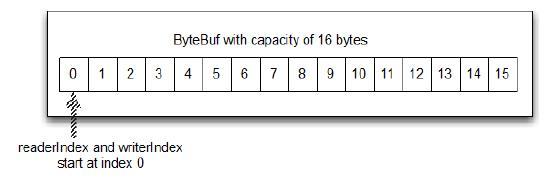
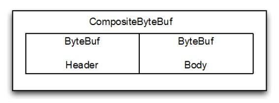

ByteBuf - 字节数据的容器
====

因为所有的网络通信最终都是基于底层的字节流传输，因此一个高效、方便、易用的数据接口是必要的，而 Netty 的 ByteBuf 满足这些需求。

ByteBuf 是一个很好的经过优化的数据容器，我们可以将字节数据有效的添加到 ByteBuf 中或从 ByteBuf 中获取数据。为了便于操作，ByteBuf 提供了两个索引：一个用于读，一个用于写。我们可以按顺序的读取数据，也可以通过调整读取数据的索引或者直接将读取位置索引作为参数传递给get方法来重复读取数据。

###ByteBuf 是如何工作的？

写入数据到 ByteBuf 后，writerIndex（写入索引）增加写入的字节数。读取字节后，readerIndex（读取索引）也增加读取出的字节数。你可以读取字节，直到写入索引和读取索引处在相同的位置。此时ByteBuf不可读，所以下一次读操作将会抛出 IndexOutOfBoundsException，就像读取数组时越位一样。

调用 ByteBuf 的以 "read" 或 "write" 开头的任何方法都将自动增加相应的索引。另一方面，"set" 、 "get"操作字节将不会移动索引位置，它们只会在指定的相对位置上操作字节。

可以给ByteBuf指定一个最大容量值，这个值限制着ByteBuf的容量。任何尝试将写入超过这个值的数据的行为都将导致抛出异常。ByteBuf 的默认最大容量限制是 Integer.MAX_VALUE。

ByteBuf 类似于一个字节数组，最大的区别是读和写的索引可以用来控制对缓冲区数据的访问。下图显示了一个容量为16的空的 ByteBuf  的布局和状态，writerIndex 和 readerIndex 都在索引位置 0 ：

Figure 5.1 A 16-byte ByteBuf with its indices set to 0

###ByteBuf 使用模式

####HEAP BUFFER(堆缓冲区)

最常用的模式是 ByteBuf 将数据存储在 JVM 的堆空间，这是通过将数据存储在数组的实现。堆缓冲区可以快速分配，当不使用时也可以快速释放。它还提供了直接访问数组的方法，通过 ByteBuf.array() 来获取 byte[]数据。
这种方法，正如清单5.1中所示的那样，是非常适合用来处理遗留数据的。

Listing 5.1 Backing array

	ByteBuf heapBuf = ...;
    if (heapBuf.hasArray()) {				//1
        byte[] array = heapBuf.array();		//2
        int offset = heapBuf.arrayOffset() + heapBuf.readerIndex();				//3
        int length = heapBuf.readableBytes();//4
        handleArray(array, offset, length); //5
    }

1.检查 ByteBuf 是否有支持数组。

2.如果有的话，得到引用数组。

3.计算第一字节的偏移量。

4.获取可读的字节数。

5.使用数组，偏移量和长度作为调用方法的参数。

注意：

* 访问非堆缓冲区 ByteBuf 的数组会导致UnsupportedOperationException， 可以使用 ByteBuf.hasArray()来检查是否支持访问数组。
* 这个用法与 JDK 的 ByteBuffer 类似

####DIRECT BUFFER(直接缓冲区)

“直接缓冲区”是另一个 ByteBuf 模式。对象的所有内存分配发生在
堆，对不对？好吧，并非总是如此。在 JDK1.4 中被引入 NIO 的ByteBuffer 类允许 JVM 通过本地方法调用分配内存，其目的是

* 通过免去中间交换的内存拷贝, 提升IO处理速度;
直接缓冲区的内容可以驻留在垃圾回收扫描的堆区以外。
* DirectBuffer 在 -XX:MaxDirectMemorySize=xxM大小限制下, 使用 Heap 之外的内存, GC对此”无能为力”,也就意味着规避了在高负载下频繁的GC过程对应用线程的中断影响.(详见<http://docs.oracle.com/javase/7/docs/api/java/nio/ByteBuffer.html.>)

这就解释了为什么“直接缓冲区”对于那些通过 socket 实现数据传输的应用来说，是一种非常理想的方式。如果你的数据是存放在堆中分配的缓冲区，那么实际上，在通过 socket 发送数据之前，JVM 需要将先数据复制到直接缓冲区。

但是直接缓冲区的缺点是在内存空间的分配和释放上比堆缓冲区更复杂，另外一个缺点是如果要将数据传递给遗留代码处理，因为数据不是在堆上，你可能不得不作出一个副本，如下：

Listing 5.2 Direct buffer data access

	ByteBuf directBuf = ...
    if (!directBuf.hasArray()) {			//1
        int length = directBuf.readableBytes();//2
        byte[] array = new byte[length];	//3
        directBuf.getBytes(directBuf.readerIndex(), array);		//4	
        handleArray(array, 0, length);  //5
    }

1.检查 ByteBuf 是不是由数组支持。如果不是，这是一个直接缓冲区。

2.获取可读的字节数

3.分配一个新的数组来保存字节

4.字节复制到数组

5.将数组，偏移量和长度作为参数调用某些处理方法

显然，这比使用数组要多做一些工作。因此，如果你事前就知道容器里的数据将作为一个数组被访问，你可能更愿意使用堆内存。

####COMPOSITE BUFFER(复合缓冲区)

最后一种模式是复合缓冲区，我们可以创建多个不同的 ByteBuf，然后提供一个这些 ByteBuf 组合的视图。复合缓冲区就像一个列表，我们可以动态的添加和删除其中的 ByteBuf，JDK 的 ByteBuffer 没有这样的功能。

Netty 提供了 ByteBuf 的子类 CompositeByteBuf 类来处理复合缓冲区，CompositeByteBuf 只是一个视图。

*警告*

*CompositeByteBuf中的ByteBuf实例可能既包含堆缓冲区，也包含直接缓冲区。因此，如果只有一个实例，那么在CompositeByteBuf上调用hasArray()方法将返回该组件的hasArray()的值。否则将返回false。*

例如，一条消息由 header 和 body 两部分组成，将 header 和 body 组装成一条消息发送出去，可能 body 相同，只是 header 不同，使用CompositeByteBuf 就不用每次都重新分配一个新的缓冲区。下图显示CompositeByteBuf 组成 header 和 body：

Figure 5.2 CompositeByteBuf holding a header and body

下面代码显示了使用 JDK 的 ByteBuffer 的一个实现。两个 ByteBuffer 的数组创建保存消息的组件，第三个创建用于保存所有数据的副本。

Listing 5.3 Composite buffer pattern using ByteBuffer

    // 使用数组保存消息的各个部分
    ByteBuffer[] message = { header, body };

    // 使用副本来合并这两个部分
    ByteBuffer message2 = ByteBuffer.allocate(
            header.remaining() + body.remaining());
    message2.put(header);
    message2.put(body);
    message2.flip();

这种做法显然是低效的;分配和复制操作不是最优的方法，操纵数组使代码显得很笨拙。

下面看使用 CompositeByteBuf 的改进版本

Listing 5.4 Composite buffer pattern using CompositeByteBuf

    CompositeByteBuf messageBuf = ...;
	ByteBuf headerBuf = ...; // 可以支持或直接
	ByteBuf bodyBuf = ...; // 可以支持或直接
    messageBuf.addComponents(headerBuf, bodyBuf);
    // ....
    messageBuf.removeComponent(0); // 移除头	//2

    for (int i = 0; i < messageBuf.numComponents(); i++) {						//3
        System.out.println(messageBuf.component(i).toString());
    }

1.追加 ByteBuf 实例的 CompositeByteBuf

2.删除  索引1的 ByteBuf

3.遍历所有 ByteBuf 实例。

清单5.4 所示，你可以简单地把 CompositeByteBuf 当作一个可迭代遍历的容器。
CompositeByteBuf 不允许访问其内部可能存在的支持数组，也不允许直接访问数据，这一点类似于直接缓冲区模式，如图5.5所示。

Listing 5.5 Access data

	CompositeByteBuf compBuf = ...;
    int length = compBuf.readableBytes();	//1
    byte[] array = new byte[length];		//2
    compBuf.getBytes(compBuf.readerIndex(), array);	//3
    handleArray(array, 0, length);	//4

1.得到的可读的字节数。

2.分配一个新的数组,数组长度为可读字节长度。

3.读取字节到数组

4.使用数组，把偏移量和长度作为参数

Netty 尝试使用 CompositeByteBuf 优化 socket I/O 操作，消除
原生 JDK 中可能存在的的性能低和内存消耗问题。虽然这是在Netty 的核心代码中进行的优化，并且是不对外暴露的，但是作为开发者还是应该意识到其影响。

*CompositeByteBuf API*

*CompositeByteBuf 提供了大量的附加功能超出了它所继承的 ByteBuf。请参阅的 Netty 的 Javadoc 文档 API。*

