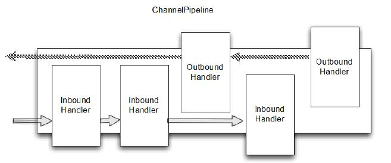

ChannelPipeline
====

ChannelPipeline 是一系列的ChannelHandler 实例,用于拦截 流经一个 Channel 的入站和出站事件,ChannelPipeline允许用户自己定义对入站/出站事件的处理逻辑，以及pipeline里的各个Handler之间的交互。

每一次创建了新的Channel ,都会新建一个新的 ChannelPipeline并绑定到Channel上。这个关联是
永久性的;Channel 既不能附上另一个 ChannelPipeline 也不能分离
当前这个。这些都由Netty负责完成,而无需开发人员的特别处理。

根据它的起源,一个事件将由 ChannelInboundHandler 或
ChannelOutboundHandler 处理。随后它将调用 ChannelHandlerContext 实现转发到下一个相同的超类型的处理程序。

*ChannelHandlerContext*

*一个 ChannelHandlerContext 使 ChannelHandler 与 ChannelPipeline 和
其他处理程序交互。一个处理程序可以通知下一个 ChannelPipeline 中的 ChannelHandler 甚至动态修改 ChannelPipeline 的归属。*

下图展示了用于入站和出站 ChannelHandler 的 典型 ChannelPipeline 布局。

Figure 6.2 ChannelPipeline and ChannelHandlers

上图说明了 ChannelPipeline 主要是一系列 ChannelHandler。通过ChannelPipeline ChannelPipeline 还提供了方法传播事件本身。如果一个入站事件被触发，它将被传递的从 ChannelPipeline 开始到结束。举个例子,在这个图中出站 I/O 事件将从 ChannelPipeline 右端开始一直处理到左边。

*ChannelPipeline 相对论*

*你可能会说,从 ChannelPipeline 事件传递的角度来看,ChannelPipeline 的“开始” 取决于是否入站或出站事件。然而,Netty 总是指 ChannelPipeline 入站口(图中的左边)为“开始”,出站口(右边)作为“结束”。当我们完成使用 ChannelPipeline.add*() 添加混合入站和出站处理程序,每个 ChannelHandler 的“顺序”是它的地位从“开始”到“结束”正如我们刚才定义的。因此,如果我们在图6.1处理程序按顺序从左到右第一个ChannelHandler被一个入站事件将是#1,第一个处理程序被出站事件将是#5*

随着管道传播事件,它决定下个 ChannelHandler 是否是相匹配的方向运动的类型。如果没有,ChannelPipeline 跳过 ChannelHandler 并继续下一个合适的方向。记住,一个处理程序可能同时实现ChannelInboundHandler 和 ChannelOutboundHandler 接口。

### 修改 ChannelPipeline 

ChannelHandler 可以实时修改 ChannelPipeline 的布局，通过添加、移除、替换其他 ChannelHandler（也可以从 ChannelPipeline 移除 ChannelHandler 自身）。这个 是 ChannelHandler 重要的功能之一。

Table 6.6 ChannelHandler methods for modifying a ChannelPipeline

名称 | 描述
------ | ----
addFirst addBefore addAfter addLast | 添加 ChannelHandler 到 ChannelPipeline.
Remove | 从 ChannelPipeline 移除 ChannelHandler.
Replace | 在 ChannelPipeline 替换另外一个 ChannelHandler

下面展示了操作

Listing 6.5 Modify the ChannelPipeline

	ChannelPipeline pipeline = null; // get reference to pipeline;
	FirstHandler firstHandler = new FirstHandler(); //1
	pipeline.addLast("handler1", firstHandler); //2
	pipeline.addFirst("handler2", new SecondHandler()); //3
	pipeline.addLast("handler3", new ThirdHandler()); //4
	
	pipeline.remove("handler3"); //5
	pipeline.remove(firstHandler); //6 
	
	pipeline.replace("handler2", "handler4", new ForthHandler()); //6

1. 创建一个 FirstHandler 实例
2. 添加该实例作为 "handler1" 到 ChannelPipeline 
3. 添加 SecondHandler 实例作为 "handler2" 到 ChannelPipeline 的第一个槽，这意味着它将替换之前已经存在的 "handler1"
4. 添加 ThirdHandler 实例作为"handler3" 到 ChannelPipeline 的最后一个槽
5. 通过名称移除 "handler3"
6. 通过引用移除 FirstHandler (因为只有一个，所以可以不用关联名字 "handler1"）.
7. 将作为"handler2"的 SecondHandler 实例替换为作为 "handler4"的  FourthHandler

以后我们将看到,这种轻松添加、移除和替换 ChannelHandler 能力，
适合非常灵活的实现逻辑。

*ChannelHandler 执行 ChannelPipeline 和阻塞*

*通常每个 ChannelHandler 添加到 ChannelPipeline 将处理事件
传递到 EventLoop( I/O 的线程)。至关重要的是不要阻塞这个线程，
它将会负面影响的整体处理I/O。
有时可能需要使用阻塞 api 接口来处理遗留代码。对于这个情况下,ChannelPipeline 已有 add() 方法,它接受一个EventExecutorGroup。如果一个定制的
EventExecutorGroup 传入事件将由含在这个 EventExecutorGroup 中的 EventExecutor之一来处理，并且从 Channel 的 EventLoop
本身离开。一个默认实现,称为来自 Netty  的 DefaultEventExecutorGroup *

除了上述操作，其他访问 ChannelHandler 的方法如下：

Table 6.7 ChannelPipeline operations for retrieving ChannelHandlers

名称 | 描述
------ | ----
get(...) | Return a ChannelHandler by type or name
context(...) | Return the ChannelHandlerContext bound to a ChannelHandler.
names() iterator() | Return the names or of all the ChannelHander in the ChannelPipeline.

### 发送事件

ChannelPipeline API 有额外调用入站和出站操作的方法。下表列出了入站操作,用于通知 ChannelPipeline 中  ChannelInboundHandlers 正在发生的事件

Table 6.8 Inbound operations on ChannelPipeline

名称 | 描述
-----|---
fireChannelRegistered | Calls channelRegistered(ChannelHandlerContext) on the next ChannelInboundHandler in the ChannelPipeline.
fireChannelUnregistered | Calls channelUnregistered(ChannelHandlerContext) on the next ChannelInboundHandler in the ChannelPipeline.
fireChannelActive | Calls channelActive(ChannelHandlerContext) on the next ChannelInboundHandler in the ChannelPipeline.
fireChannelInactive | Calls channelInactive(ChannelHandlerContext)on the next ChannelInboundHandler in the ChannelPipeline.
fireExceptionCaught | Calls exceptionCaught(ChannelHandlerContext, Throwable) on the next ChannelHandler in the ChannelPipeline.
fireUserEventTriggered | Calls userEventTriggered(ChannelHandlerContext, Object) on the next ChannelInboundHandler in the ChannelPipeline.
fireChannelRead | Calls channelRead(ChannelHandlerContext, Object msg) on the next ChannelInboundHandler in the ChannelPipeline.
fireChannelReadComplete | Calls channelReadComplete(ChannelHandlerContext) on the next ChannelStateHandler in the ChannelPipeline.

在出站方面,处理一个事件将导致底层套接字的一些行动。下表列出了ChannelPipeline API 出站的操作。

Table 6.9 Outbound operations on ChannelPipeline

名称 | 描述
-----|---
bind | Bind the Channel to a local address. This will call bind(ChannelHandlerContext, SocketAddress, ChannelPromise) on the next ChannelOutboundHandler in the ChannelPipeline.
connect | Connect the Channel to a remote address. This will call connect(ChannelHandlerContext, SocketAddress,ChannelPromise) on the next ChannelOutboundHandler in the ChannelPipeline.
disconnect | Disconnect the Channel. This will call disconnect(ChannelHandlerContext, ChannelPromise) on the next ChannelOutboundHandler in the ChannelPipeline.
close | Close the Channel. This will call close(ChannelHandlerContext,ChannelPromise) on the next ChannelOutboundHandler in the ChannelPipeline.
deregister | Deregister the Channel from the previously assigned EventExecutor (the EventLoop). This will call deregister(ChannelHandlerContext,ChannelPromise) on the next ChannelOutboundHandler in the ChannelPipeline.
flush | Flush all pending writes of the Channel. This will call flush(ChannelHandlerContext) on the next ChannelOutboundHandler in the ChannelPipeline.
write | Write a message to the Channel. This will call write(ChannelHandlerContext, Object msg, ChannelPromise) on the next ChannelOutboundHandler in the ChannelPipeline. Note: this does not write the message to the underlying Socket, but only queues it. To write it to the Socket call flush() or writeAndFlush().
writeAndFlush | Convenience method for calling write() then flush().
read | Requests to read more data from the Channel. This will call read(ChannelHandlerContext) on the next ChannelOutboundHandler in the ChannelPipeline.

总结下：

* 一个 ChannelPipeline 是用来保存关联到一个 Channel 的ChannelHandler 
* 可以修改 ChannelPipeline 通过动态添加和删除 ChannelHandler
* ChannelPipeline 有着丰富的API调用动作来回应入站和出站事件。
