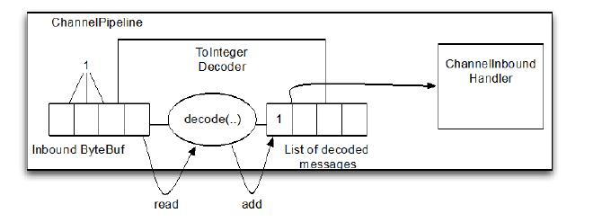
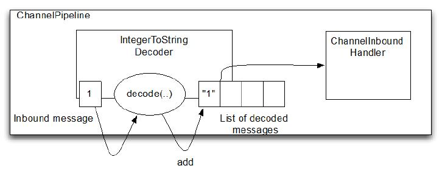

Decoder(解码器)
====

本节，会提供几个类用于 decoder 的实现，以及一些可能会用到的例子。

Netty 提供了丰富的解码器抽象基类，我们可以很容易的实现这些基类来自定义解码器。主要分两类：
* 解码字节到消息（ByteToMessageDecoder 和 ReplayingDecoder）
* 解码消息到消息（MessageToMessageDecoder）

decoder 负责解码“入站”数据从一种格式到另一种格式，解码器处理入站数据是抽象 ChannelInboundHandler 的实现。实践中使用解码器很简单，就是将入站数据转换格式后传递到 ChannelPipeline 中的下一个ChannelInboundHandler 进行处理；这样的处理时很灵活的，我们可以将解码器放在 ChannelPipeline 中，重用逻辑。

### ByteToMessageDecoder 

ByteToMessageDecoder 是用于将字节转为消息（或其他字节序列）。

你不能知道远端是否会发送一个完整的“信息”,因此这个类缓存入站,直到准备好了用于处理。表7.1说明了它的两个最重要的方法。

Table 7.1 ByteToMessageDecoder API

方法名称 | 描述
-------|------
Decode | This is the only abstract method you need to implement. It is called with a ByteBuf having the incoming bytes and a List into which decoded messages are added. decode() is called repeatedly until the List is empty on return. The contents of the List are then passed to the next handler in the pipeline.
decodeLast | The default implementation provided simply calls decode().This method is called once, when the Channel goes inactive. Override to provide special
handling

假设我们接收一个字节包含简单的整数流,每个单独处理。在本例中,我们将从入站 ByteBuf 读取每个整数并将其传递给 pipeline 中的下一个ChannelInboundHandler。“解码”字节流成整数我们将扩展ByteToMessageDecoder，实现类为“ToIntegerDecoder”,如图7.1所示。

Figure 7.1 ToIntegerDecoder

每次从入站的 ByteBuf 读取四个字节，解码成整形，并添加到一个 List （本例是指 Integer）,当不能再添加数据到 lsit 时，它所包含的内容就会发送到下个 ChannelInboundHandler

Listing 7.1 ByteToMessageDecoder that decodes to Integer

	public class ToIntegerDecoder extends ByteToMessageDecoder {  //1
	
	    @Override
	    public void decode(ChannelHandlerContext ctx, ByteBuf in, List<Object> out)
	            throws Exception {
	        if (in.readableBytes() >= 4) {  //2
	            out.add(in.readInt());  //3
	        }
	    }
	}

1. 实现继承了 ByteToMessageDecode 用于将字节解码为消息
2. 检查可读的字节是否至少有4个 ( int 是4个字节长度)
3. 从入站 ByteBuf 读取 int ， 添加到解码消息的 List 中

尽管 ByteToMessageDecoder 简化了这个模式,你会发现它有点烦人,在实际的读操作(这里 readInt())之前，必须要验证输入的 ByteBuf 要有足够的数据。在下一节中,我们将看看 ReplayingDecoder,一个特殊的解码器。

章节5和6中提到,应该特别注意引用计数器。编码器和解码器的过程非常简单。一旦一个消息被编码或解码它自动被调用ReferenceCountUtil.release(message) 。如果你需要下步用到这个引用而不是马上释放,你可以调用 ReferenceCountUtil.retain(message)。这将增加引用计数,防止消息被释放。

### ReplayingDecoder 

ReplayingDecoder 是 byte-to-message 解码的一种特殊的抽象基类，读取缓冲区的数据之前需要检查缓冲区是否有足够的字节，使用ReplayingDecoder就无需自己检查；若ByteBuf中有足够的字节，则会正常读取；若没有足够的字节则会停止解码。

*ByteToMessageDecoder 和 ReplayingDecoder*

*注意到 ReplayingDecoder 继承自 ByteToMessageDecoder ，所以API 跟表 7.1 是相同的 *

也正因为这样的包装使得 ReplayingDecoder 带有一定的局限性：

* 不是所有的标准 ByteBuf 操作都被支持，如果调用一个不支持的操作会抛出 UnreplayableOperationException
* ReplayingDecoder 略慢于 ByteToMessageDecoder

如果这些限制是可以接受你可能更喜欢使用 ReplayingDecoder。下面是一个简单的准则:

如果不引入过多的复杂性 使用 ByteToMessageDecoder 。否则,使用ReplayingDecoder。

Listing 7.2 ReplayingDecoder

	public class ToIntegerDecoder2 extends ReplayingDecoder<Void> {   //1
	
	    @Override
	    public void decode(ChannelHandlerContext ctx, ByteBuf in, List<Object> out)
	            throws Exception {
	        out.add(in.readInt());  //2
	    }
	}

1. 实现继承自 ReplayingDecoder 用于将字节解码为消息
2. 从入站 ByteBuf 读取整型，并添加到解码消息的 List 中

如果我们比较清单7.1和7.2很明显,实现使用 ReplayingDecoder 更简单。

*更多 Decoder*

*下面是更加复杂的使用场景： io.netty.handler.codec.LineBasedFrameDecoder 通过结束控制符("\n" 或 "\r\n").解析入站数据。 io.netty.handler.codec.http.HttpObjectDecoder 用于 HTTP 数据解码*

### MessageToMessageDecoder 

用于从一种消息解码为另外一种消息（例如，POJO 到 POJO），下表展示了方法：

Table 7.2 MessageToMessageDecoder API

方法名称 | 描述
-------|------
decode | decode is the only abstract method you need to implement. It is called for each inbound message to be decoded to another format . The decoded messages are then passed to the next ChannelInboundHandler in the pipeline.
decodeLast | The default implementation provided simply calls decode().This method is called once, when the Channel goes inactive. Override to provide special
handling

将 Integer 转为 String，我们提供了 IntegerToStringDecoder，继承自 MessageToMessageDecoder。

因为这是一个参数化的类,实现的签名是:

	public class IntegerToStringDecoder extends MessageToMessageDecoder<Integer>

decode() 方法的签名是 

	protected void decode( ChannelHandlerContext ctx,
	Integer msg, List<Object> out ) throws Exception

也就是说,入站消息是通过在类定义中声明的参数类型(这里是 Integer) 而不是 ByteBuf。在之前的例子,解码消息(String)将被添加到List<Object>，并传递到下个 ChannelInboundHandler。
这是如图7.2所示。

Figure 7.2 IntegerToStringDecoder

实现如下：

Listing 7.3 MessageToMessageDecoder - Integer to String

	public class IntegerToStringDecoder extends
	        MessageToMessageDecoder<Integer> { //1
	
	    @Override
	    public void decode(ChannelHandlerContext ctx, Integer msg, List<Object> out)
	            throws Exception {
	        out.add(String.valueOf(msg)); //2
	    }
	}

1. 实现继承自 MessageToMessageDecoder
2. 通过 String.valueOf() 转换 Integer 消息字符串

正如我们上面指出的,参数类型应用于类(Integer)指定消息的类型参数decode()。

*HttpObjectAggregator*

*更多复杂的示例，请查看类
io.netty.handler.codec.http.HttpObjectAggregator,继承自MessageToMessageDecoder<HttpObject>*

### 在解码时处理太大的帧