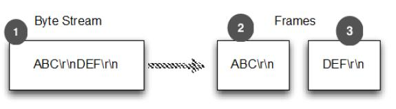
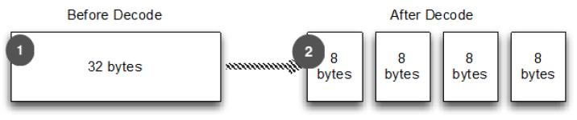
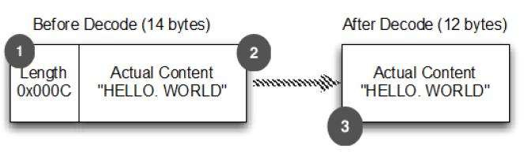

解码分隔符和基于长度的协议
====

使用 Netty 时会遇到需要解码以分隔符和长度为基础的协议，本节讲解Netty 如何解码这些协议。

### 分隔符协议
        
经常需要处理分隔符协议或创建基于它们的协议，例如[SMTP](http://www.ietf.org/rfc/rfc2821.txt)、[POP3](http://www.ietf.org/rfc/rfc1939.txt)、[IMAP](http://tools.ietf.org/html/rfc3501)、[Telnet](http://tools.ietf.org/search/rfc854)等等。Netty 附带的解码器可以很容易的提取一些序列分隔：

Table 8.5 Decoders for handling delimited and length-based protocols

名称 | 描述
-----|----
DelimiterBasedFrameDecoder | 接收ByteBuf由一个或多个分隔符拆分，如NUL或换行符
LineBasedFrameDecoder| 接收ByteBuf以分割线结束，如"\n"和"\r\n"

下图显示了使用"\r\n"分隔符的处理：



1. 字节流
2. 第一帧
3. 第二帧

Figure 8.5 Handling delimited frames

下面展示了如何用 LineBasedFrameDecoder 处理

Listing 8.8 Handling line-delimited frames
    
    public class LineBasedHandlerInitializer extends ChannelInitializer<Channel> {
    
        @Override
        protected void initChannel(Channel ch) throws Exception {
            ChannelPipeline pipeline = ch.pipeline();
            pipeline.addLast(new LineBasedFrameDecoder(65 * 1024));   //1
            pipeline.addLast(new FrameHandler());  //2
        }
    
        public static final class FrameHandler extends SimpleChannelInboundHandler<ByteBuf> {
            @Override
            public void channelRead0(ChannelHandlerContext ctx, ByteBuf msg) throws Exception {  //3
                // Do something with the frame
            }
        }
    }

1. 添加一个 LineBasedFrameDecoder 用于提取帧并把数据包转发到下一个管道中的处理程序,在这种情况下就是 FrameHandler  
2. 添加 FrameHandler 用于接收帧
3. 每次调用都需要传递一个单帧的内容

使用 DelimiterBasedFrameDecoder 可以方便处理特定分隔符作为数据结构体的这类情况。如下：

* 传入的数据流是一系列的帧，每个由换行（“\n”）分隔
* 每帧包括一系列项目，每个由单个空格字符分隔
* 一帧的内容代表一个“命令”：一个名字后跟一些变量参数

清单8.9中显示了的实现的方式。定义以下类：

* 类 Cmd - 存储帧的内容，其中一个 ByteBuf 用于存名字，另外一个存参数
* 类 CmdDecoder - 从重写方法 decode() 中检索一行，并从其内容中构建一个 Cmd 的实例
* 类 CmdHandler - 从 CmdDecoder 接收解码 Cmd 对象和对它的一些处理。

所以关键的解码器是扩展了 LineBasedFrameDecoder

Listing 8.9 Decoder for the command and the handler

	public class CmdHandlerInitializer extends ChannelInitializer<Channel> {
	
	    @Override
	    protected void initChannel(Channel ch) throws Exception {
	        ChannelPipeline pipeline = ch.pipeline();
	        pipeline.addLast(new CmdDecoder(65 * 1024));//1
	        pipeline.addLast(new CmdHandler()); //2
	    }
	
	    public static final class Cmd { //3
	        private final ByteBuf name;
	        private final ByteBuf args;
	
	        public Cmd(ByteBuf name, ByteBuf args) {
	            this.name = name;
	            this.args = args;
	        }
	
	        public ByteBuf name() {
	            return name;
	        }
	
	        public ByteBuf args() {
	            return args;
	        }
	    }
	
	    public static final class CmdDecoder extends LineBasedFrameDecoder {
	        public CmdDecoder(int maxLength) {
	            super(maxLength);
	        }
	
	        @Override
	        protected Object decode(ChannelHandlerContext ctx, ByteBuf buffer) throws Exception {
	            ByteBuf frame =  (ByteBuf) super.decode(ctx, buffer); //4
	            if (frame == null) {
	                return null; //5
	            }
	            int index = frame.indexOf(frame.readerIndex(), frame.writerIndex(), (byte) ' ');  //6
	            return new Cmd(frame.slice(frame.readerIndex(), index), frame.slice(index +1, frame.writerIndex())); //7
	        }
	    }
	
	    public static final class CmdHandler extends SimpleChannelInboundHandler<Cmd> {
	        @Override
	        public void channelRead0(ChannelHandlerContext ctx, Cmd msg) throws Exception {
	            // Do something with the command  //8
	        }
	    }
	}

1. 添加一个 CmdDecoder 到管道；将提取 Cmd 对象和转发到在管道中的下一个处理器
2. 添加 CmdHandler 将接收和处理 Cmd 对象
3. 命令也是 POJO
4. super.decode() 通过结束分隔从 ByteBuf 提取帧
5. frame 是空时，则返回 null
6. 找到第一个空字符的索引。首先是它的命令名；接下来是参数的顺序
7. 从帧先于索引以及它之后的片段中实例化一个新的 Cmd 对象
8. 处理通过管道的 Cmd 对象

### 基于长度的协议

基于长度的协议协议在帧头文件里定义了一个帧编码的长度,而不是结束位置用一个特殊的分隔符来标记。表8.6列出了 Netty 提供的两个解码器，用于处理这种类型的协议。

Table 8.6 Decoders for length-based protocols

名称 | 描述
-----|----
FixedLengthFrameDecoder | 提取固定长度
LengthFieldBasedFrameDecoder | 读取头部长度并提取帧的长度

如下图所示，FixedLengthFrameDecoder 的操作是提取固定长度每帧8字节



1. 字节流 stream
2. 4个帧，每个帧8个字节

大部分时候帧的大小被编码在头部，这种情况可以使用LengthFieldBasedFrameDecoder，它会读取头部长度并提取帧的长度。下图显示了它是如何工作的：



1. 长度 "0x000C" (12) 被编码在帧的前两个字节
2. 后面的12个字节就是内容
3. 提取没有头文件的帧内容

Figure 8.7 Message that has frame size encoded in the header

LengthFieldBasedFrameDecoder 提供了几个构造函数覆盖各种各样的头长字段配置情况。清单8.10显示了使用三个参数的构造函数是maxFrameLength,lengthFieldOffset lengthFieldLength。在这
情况下,帧的长度被编码在帧的前8个字节。

Listing 8.10 Decoder for the command and the handler

```java
public class LengthBasedInitializer extends ChannelInitializer<Channel> {
	@Override
	protected void initChannel(Channel ch) throws Exception {
		ChannelPipeline pipeline = ch.pipeline();
		pipeline.addLast(
		new LengthFieldBasedFrameDecoder(65 * 1024, 0, 8)); //1
		pipeline.addLast(new FrameHandler()); //2
	}
		
	public static final class FrameHandler
		extends SimpleChannelInboundHandler<ByteBuf> {
		@Override
		public void channelRead0(ChannelHandlerContext ctx,
		ByteBuf msg) throws Exception {
		// Do something with the frame //3
		}
	}
}
```

1. 添加一个 LengthFieldBasedFrameDecoder ,用于提取基于帧编码长度8个字节的帧。
2. 添加一个 FrameHandler 用来处理每帧
3. 处理帧数据

总而言之,本部分探讨了 Netty 提供的编解码器支持协议,包括定义特定的分隔符的字节流的结构或协议帧的长度。这些编解码器非常有用。

