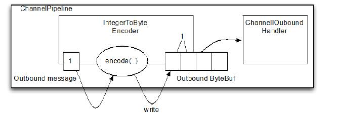

Encoder(编码器)
====

回顾之前的定义，encoder 是转换出站数据从一种格式到另外一种格式，因此它实现了 ChanneOutboundHandler， Netty 提供以下与 decoder 相反的方法：

* 编码从消息到字节
* 编码从消息到消息

### MessageToByteEncoder

MessageToByteEncoder 是跟 ByteToMessageDecoder. 功能相反的。

Table 7.3 MessageToByteEncoder API

方法名称 | 描述
-------|------
encode | The encode method is the only abstract method you need to implement. It is called with the outbound message, which this class will encodes to a ByteBuf. The ByteBuf is then forwarded to the next ChannelOutboundHandler in the ChannelPipeline.

这个类只有一个方法，而 decoder 却是有两个，原因就是 decoder 经常需要在 Channel 关闭时产生一个“最后的消息”。出于这个原因，提供了decodeLast()，而 encoder 没有这个需求。

下面示例，我们想产生 Short 值，并想将他们编码成 ByteBuf 来发送到 线上，我们提供了 ShortToByteEncoder 来实现该目的。

Figure 7.3 ShortToByteEncoder

上图展示了，encoder 收到了 Short 消息，编码他们，并把他们写入 ByteBuf。 ByteBuf 接着前进到下一个 pipeline 的ChannelOutboundHandler。每个 Short 将占用 ByteBuf 的两个字节

Listing 7.5 ShortToByteEncoder encodes shorts into a ByteBuf

	public class ShortToByteEncoder extends
	        MessageToByteEncoder<Short> {  //1
	    @Override
	    public void encode(ChannelHandlerContext ctx, Short msg, ByteBuf out)
	            throws Exception {
	        out.writeShort(msg);  //2
	    }
	}

1. 实现继承自 MessageToByteEncoder
2. 写 Short 到 ByteBuf