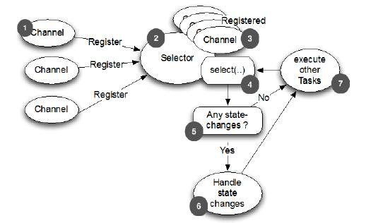

包含的 Transport
=====

Netty 自带了一些传输协议的实现，虽然没有支持所有的传输协议，但是其自带的已足够我们来使用。Netty应用程序的传输协议依赖于底层协议，本节我们将学习Netty中的传输协议。

Netty中的传输方式有如下几种：

Table 4.1 Provided transports

方法名称     |包 |描述 
-------- | ------- |--- 
NIO|io.netty.channel.socket.nio|基于java.nio.channels的工具包，使用选择器作为基础的方法。
OIO|io.netty.channel.socket.oio|基于java.net的工具包，使用阻塞流。
Local|io.netty.channel.local|用来在虚拟机之间本地通信。
Embedded|io.netty.channel.embedded|嵌入传输，它允许在没有真正网络的传输中使用 ChannelHandler，可以非常有用的来测试ChannelHandler的实现。

###NIO-Nonblocking I/O 

NIO传输是目前最常用的方式，它通过使用选择器提供了完全异步的方式操作所有的 I/O，NIO 从Java 1.4才被提供。

NIO 中，我们可以注册一个通道或获得某个通道的改变的状态，通道状态有下面几种改变：

* 一个新的 Channel 被接受并已准备好
* Channel 连接完成
* Channel 中有数据并已准备好读取
* Channel 发送数据出去
        
处理完改变的状态后需重新设置他们的状态，用一个线程来检查是否有已准备好的 Channel，如果有则执行相关事件。在这里可能只同时一个注册的事件而忽略其他的。选择器所支持的操作在 SelectionKey 中定义，具体如下：

Table 4.2 Selection operation bit-set

方法名称  |描述 
-------- |--- 
OP_ACCEPT | 有新连接时得到通知
OP_CONNECT | 连接完成后得到通知
OP_REA | 准备好读取数据时得到通知
OP_WRITE | 写入更多数据到通道时得到通知，大部分时间
这是可能的，但有时 socket 缓冲区完全填满了。这通常发生在你写数据的速度太快了超过了远程节点的处理能力。

Figure 4.2 Selecting and Processing State Changes

1.新信道注册 WITH 选择器

2.选择处理的状态变化的通知

3.以前注册的通道

4.Selector.select（）方法阻塞，直到新的状态变化接收或配置的超时
已过

5.检查是否有状态变化

6.处理所有的状态变化

7.在选择器操作的同一个线程执行其他任务

有一种功能，目前仅适用于 NIO 传输叫什么 “zero-file-copy （零文件拷贝）”，这使您能够快速，高效地通过移动数据到从文件系统传输内容
网络协议栈而无需复制从内核空间到用户空间。这可以使 FT P或 HTTP 协议有很大的不同。

然而，并非所有的操作系统都支持此功能。此外，你不能用它实现数据加密或压缩文件系统 - 仅支持文件的原生内容。另一方面，传送的文件原本已经加密的是完全有效的。

接下来，我们将讨论的是 OIO ，它提供了一个阻塞传输。

###OIO-Old blocking I/O

Netty 中，该 OIO 传输代表了一种妥协。它通过了 Netty 的通用 API 访问但不是异步，而是构建在 java.net 的阻塞实现上。任何人下面讨论这一点可能会认为，这个协议并没有很大优势。但它确实有它有效的用途。

假设你需要的端口使用该做阻塞调用库（例如 [JDBC](http://www.oracle.com/technetwork/java/javase/jdbc/index.html)）。它可能不适合非阻塞。相反，你可以在短期内使用 OIO 传输，后来移植到纯异步的传输上。让我们看看它是如何工作的。

在 java.net API，你通常有一个线程接受新的连接到达监听在ServerSocket，并创建一个新的线程来处理新的 Socket 。这是必需的，因为在一个特定的 socket的每个 I/O 操作可能会阻塞在任何时间。在一个线程处理多个 socket 易造成阻塞操作，一个　socket　占用了所有的其他人。

鉴于此，你可能想知道　Netty　是如何用相同的　API　来支持　NIO　的异步传输。这里的　Netty　利用了　SO_TIMEOUT　标志，可以设置在一个　Socket。这　timeout　指定最大　毫秒　数量　用于等待　I/O　的操作完成。如果操作在指定的时间内失败，SocketTimeoutException　会被抛出。 Netty中捕获该异常并继续处理循环。在接下来的事件循环运行，它再次尝试。像　Netty　的异步架构来支持　OIO　的话，这其实是唯一的办法。当SocketTimeoutException　抛出时，执行　stack trace。

Figure 4.3 OIO-Processing logic

1.线程分配给 Socket

2.Socket 连接到远程

3.读操作（可能会阻塞）

4.读完成

5.处理可读的字节
 
6.执行提交到 socket 的其他任务

7.再次尝试读

### 同个 JVM 内的本地 Transport 通信 

Netty 提供了“本地”传输，为运行在同一个 Java 虚拟机上的服务器和客户之间提供异步通信。此传输支持所有的 Netty 常见的传输实现的 API。

在此传输中，与服务器 Channel 关联的 SocketAddress 不是“绑定”到一个物理网络地址中，而是在服务器是运行时它被存储在注册表中，当 Channel 关闭时它会注销。由于该传输不是“真正的”网络通信，它不能与其他传输实现互操作。因此，客户端是希望连接到使用本地传输的的服务器时，要注意正确的用法。除此限制之外，它的使用是与其他的传输是相同的。

### 内嵌 Transport 

Netty中 还提供了可以嵌入 ChannelHandler 实例到其他的 ChannelHandler 的传输，使用它们就像辅助类，增加了灵活性的方法，使您可以与你的 ChannelHandler 互动。

该嵌入技术通常用于测试 ChannelHandler 的实现，但它也可用于将功能添加到现有的 ChannelHandler 而无需更改代码。嵌入传输的关键是Channel 的实现，称为“EmbeddedChannel”。

第10章描述了使用 EmbeddedChannel 来测试 ChannelHandlers。