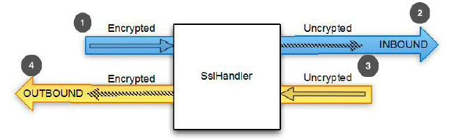

使用 SSL/TLS 加密 Netty 程序
====

今天数据隐私是一个十分关注的问题,作为开发人员,我们需要准备好解决这个问题。至少我们需要熟悉加密协议 SSL 和 [TLS](ttp://tools.ietf.org/html/rfc5246) 等之上的其他协议实现数据安全。作为一个 HTTPS 网站的用户,你是安全。当然,这些协议是广泛不基于 http 的应用程序,例如安全SMTP(SMTPS)邮件服务,甚至关系数据库系统。
 
为了支持 SSL/TLS,Java 提供了 javax.net.ssl API 的类SslContext 和 SslEngine 使它相对简单的实现解密和加密。Netty 的利用该 API 命名 SslHandler 的 ChannelHandler 实现,
有一个内部 SslEngine 做实际的工作。

图8.1显示了一个使用 SslHandler 数据流图。

1. 加密的入站数据被 SslHandler 拦截，并被解密
2. 前面加密的数据被 SslHandler 解密
3. 平常数据传过 SslHandler
4. SslHandler 加密数据并它传递出站

Figure 8.1 Data flow through SslHandler for decryption and encryption

如清单8.1所示一个 SslHandler 使用 ChannelInitializer 添加到 ChannelPipeline。(回想一下,当 Channel 注册时 ChannelInitializer 用于设置 ChannelPipeline 。)

Listing 8.1 Add SSL/TLS support

	public class SslChannelInitializer extends ChannelInitializer<Channel> {
	
	    private final SslContext context;
	    private final boolean startTls;
	    public SslChannelInitializer(SslContext context,
		boolean client, boolean startTls) {   //1
	        this.context = context;
	        this.startTls = startTls;
	    }
	    @Override
	    protected void initChannel(Channel ch) throws Exception {
	        SSLEngine engine = context.newEngine(ch.alloc());  //2
			engine.setUseClientMode(client); //3
	        ch.pipeline().addFirst("ssl", new SslHandler(engine, startTls));  //4
	    }
	}

1. 使用构造函数来传递 SSLContext 用于使用(startTls 是否启用)
2. 从 SslContext 获得一个新的 SslEngine 。给每个 SslHandler 实例使用一个新的 SslEngine 
3. 设置 SslEngine 是  client 或者是 server 模式
4. 添加 SslHandler 到 pipeline 作为第一个处理器

在大多数情况下,SslHandler 将成为 ChannelPipeline  中的第一个 ChannelHandler 。这将确保所有其他 ChannelHandler 应用他们的逻辑到数据后加密后才发生,从而确保他们的变化是安全的。

SslHandler 有很多有用的方法,如表8.1所示。例如,在握手阶段两端相互验证,商定一个加密方法。您可以配置 SslHandler 修改其行为或提供 在SSL/TLS 握手完成后发送通知,这样所有数据都将被加密。 SSL/TLS 握手将自动执行。

Table 8.1 SslHandler methods

名称 | 描述
-----|----
setHandshakeTimeout(...) setHandshakeTimeoutMillis(...) getHandshakeTimeoutMillis() | Set and get the timeout, after which the handshake ChannelFuture is notified of failure.
setCloseNotifyTimeout(...) setCloseNotifyTimeoutMillis(...) getCloseNotifyTimeoutMillis() | Set and get the timeout after which the close notify will time out and the connection will close. This also results in having the close notify ChannelFuture fail.
handshakeFuture() | Returns a ChannelFuture that will be notified once the handshake is complete. If the handshake was done before it will return a ChannelFuture that contains the result of the previous handshake.
close(...) | Send the close_notify to request close and destroy the underlying SslEngine.