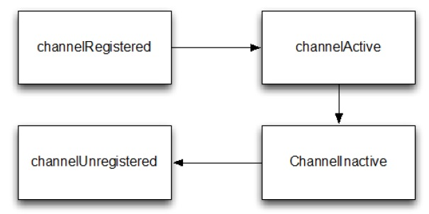

ChannelHandler 家族
====

在我们深入研究 Channelhandler 内部之前，让我们花几分钟了解下这个领域的 Netty 组件模型的基础。这里提供一个  Channelhandler 及其子类的研究有价值的背景。

### Channel 生命周期

Channel 有个简单但强大的状态模型，与
ChannelInboundHandler API  密切相关。下面表格是 Channel 的四个状态

Table 6.1 Channel lifeycle states

状态 | 描述
-----|---------
channelUnregistered  | channel创建但未注册到一个 EventLoop.
channelRegistered  | channel 注册到一个 EventLoop.
channelActive | channel 的活动的(连接到了它的  remote peer（远程对等方）)，现在可以接收和发送数据了
channelInactive  | channel 没有连接到 remote peer（远程对等方）

Channel 的正常的生命周期如下图，当这些状态变化出现，对应的事件将会生成，这样与 ChannelPipeline 中的 ChannelHandler 的交互就能及时响应

Figure 6.1 Channel State Model

###ChannelHandler 生命周期

ChannelHandler 定义的生命周期操作如下表，当 ChannelHandler 添加到 ChannelPipeline，或者从 ChannelPipeline 移除后，这些将会调用。每个方法都会带 ChannelHandlerContext 参数

Table 6.2 ChannelHandler lifecycle methods

类型 | 描述
-----|---------
handlerAdded  | 当 ChannelHandler 添加到 ChannelPipeline 调用
handlerRemoved | 当 ChannelHandler 从 ChannelPipeline 移除时调用
exceptionCaught | 当 ChannelPipeline 执行发生错误时调用

###ChannelHandler 子接口

Netty 提供2个重要的 ChannelHandler 子接口：

* ChannelInboundHandler - 处理进站数据，并且所有状态都更改
* ChannelOutboundHandler - 处理出站数据，允许拦截各种操作

*ChannelHandler 适配器*

*Netty 提供了一个简单的 ChannelHandler 框架实现，给所有声明方法签名。这个类 ChannelHandlerAdapter 的方法,主要推送事件 到 pipeline 下个 ChannelHandler 直到 pipeline 的结束。这个类
也作为 ChannelInboundHandlerAdapter 和ChannelOutboundHandlerAdapter 的基础。所有三个适配器类的目的是作为自己的实现的起点;您可以扩展它们,覆盖你需要自定义的方法。*

###ChannelInboundHandler 

ChannelInboundHandler  的生命周期方法在下表中，当接收到数据或者与之关联的 Channel 状态改变时调用。之前已经注意到了，这些方法与 Channel 的生命周期接近

Table 6.3 ChannelInboundHandler methods

类型 | 描述
-----|---------
channelRegistered  | Invoked when a Channel is registered to its EventLoop and is able to handle I/O.
channelUnregistered  | Invoked when a Channel is deregistered from its EventLoop and cannot handle any I/O.
channelActive  | Invoked when a Channel is active; the Channel is connected/bound and ready.
channelInactive | Invoked when a Channel leaves active state and is no longer connected to its remote peer.
channelReadComplete  |  Invoked when a read operation on the Channel has completed.
channelRead  | Invoked if data are read from the Channel.
channelWritabilityChanged |  Invoked when the writability state of the Channel changes. The user can ensure writes are not done too fast (with risk of an OutOfMemoryError) or can resume writes when the Channel becomes writable again.Channel.isWritable() can be used to detect the actual writability of the channel. The threshold for writability can be set via Channel.config().setWriteHighWaterMark() and Channel.config().setWriteLowWaterMark().
userEventTriggered(...) | Invoked when a user calls Channel.fireUserEventTriggered(...) to pass a pojo through the ChannelPipeline. This can be used to pass user specific events through the ChannelPipeline and so allow handling those events.

注意，ChannelInboundHandler 实现覆盖了 channelRead() 方法处理进来的数据用来响应释放资源。Netty 在 ByteBuf 上使用了资源池，所以当执行释放资源时可以减少内存的消耗。

Listing 6.1 Handler to discard data
 
	@ChannelHandler.Sharable
	public class DiscardHandler extends ChannelInboundHandlerAdapter {		//1
	
	    @Override
	    public void channelRead(ChannelHandlerContext ctx,
	                                     Object msg) {
	        ReferenceCountUtil.release(msg); //2
	    }
	
	}

1.扩展 ChannelInboundHandlerAdapter

2.ReferenceCountUtil.release() 来丢弃收到的信息

Netty 用一个 WARN-level 日志条目记录未释放的资源,使其能相当简单
地找到代码中的违规实例。然而,由于手工管理资源会很繁琐,您可以通过使用 SimpleChannelInboundHandler 简化问题。如下：

Listing 6.2 Handler to discard data

	@ChannelHandler.Sharable
	public class SimpleDiscardHandler extends SimpleChannelInboundHandler<Object> {  //1
	
	    @Override
	    public void channelRead0(ChannelHandlerContext ctx,
	                                     Object msg) {
			// No need to do anything special //2
	    }
	
	}

1.扩展 SimpleChannelInboundHandler

2.不需做特别的释放资源的动作

注意 SimpleChannelInboundHandler 会自动释放资源，而无需存储任何信息的引用。

更多详见 “Error! Reference source not found..” 一节

###ChannelOutboundHandler 

ChannelOutboundHandler 提供了出站操作时调用的方法。这些方法会被 Channel, ChannelPipeline, 和 ChannelHandlerContext调用。

ChannelOutboundHandler 另个一个强大的方面是它具有在请求时延迟操作或者事件的能力。比如，当你在写数据到 remote peer 的过程中被意外暂停，你可以延迟执行刷新操作，然后在迟些时候继续。

下面显示了 ChannelOutboundHandler 的方法（继承自 ChannelHandler 未列出来）

Table 6.4 ChannelOutboundHandler methods

类型 | 描述
-----|---------
bind  | Invoked on request to bind the Channel to a local address
connect |  Invoked on request to connect the Channel to the remote peer
disconnect |  Invoked on request to disconnect the Channel from the remote peer
close  | Invoked on request to close the Channel
deregister |  Invoked on request to deregister the Channel from its EventLoop
read  | Invoked on request to read more data from the Channel
flush  | Invoked on request to flush queued data to the remote peer through the Channel
write  | Invoked on request to write data through the Channel to the remote peer

几乎所有的方法都将 ChannelPromise 作为参数,一旦请求结束要通过 ChannelPipeline 转发的时候，必须通知此参数。

*ChannelPromise vs. ChannelFuture*

*ChannelPromise 是 特殊的 ChannelFuture，允许你的ChannelPromise 及其 操作 成功或失败。所以任何时候调用例如 Channel.write(...) 一个新的  ChannelPromise 将会创建并且通过 ChannelPipeline传递。这次写操作本身将会返回 ChannelFuture， 这样只允许你得到一次操作完成的通知。Netty 本身使用 ChannelPromise 作为返回的 ChannelFuture 的通知，事实上在大多数时候就是 ChannelPromise自身（ChannelPromise 扩展了 ChannelFuture）*