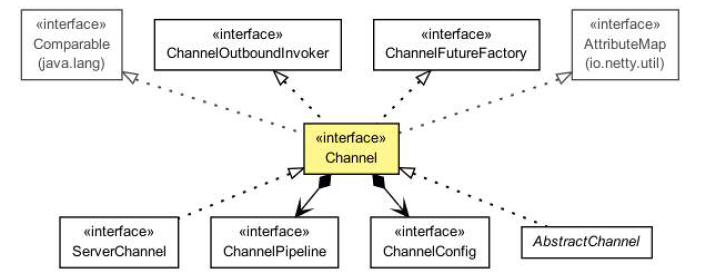

Transport API
======

Transport API 的核心是 Channel 接口，用于所有的出站操作，见下图

如上图所示，每个 Channel 都会分配一个 ChannelPipeline 和ChannelConfig。ChannelConfig 负责设置并存储 Channel 的配置，并允许在运行期间更新它们。传输一般有特定的配置设置，可能实现了 ChannelConfig. 的子类型。

ChannelPipeline 容纳了使用的 ChannelHandler 实例，这些ChannelHandler 将处理通道传递的“入站”和“出站”数据以及事件。ChannelHandler 的实现允许你改变数据状态和传输数据。

现在我们可以使用 ChannelHandler 做下面一些事情：

* 传输数据时，将数据从一种格式转换到另一种格式
* 异常通知
* Channel 变为 active（活动） 或 inactive（非活动） 时获得通知* Channel 被注册或注销时从 EventLoop 中获得通知
* 通知用户特定事件

*Intercepting Filter（拦截过滤器）*

*ChannelPipeline 实现了常用的 Intercepting Filter（拦截过滤器）设计模式。UNIX管道是另一例子：命令链接在一起，一个命令的输出连接到
的下一行中的输入。*

你还可以在运行时根据需要添加 ChannelHandler 实例到ChannelPipeline 或从 ChannelPipeline 中删除，这能帮助我们构建高度灵活的 Netty 程序。例如，你可以支持 [STARTTLS](http://en.wikipedia.org/wiki/STARTTLS) 协议，只需通过加入适当的 ChannelHandler（这里是 SslHandler）到的ChannelPipeline 中，当被请求这个协议时。

此外，访问指定的 ChannelPipeline 和 ChannelConfig，你能在Channel 自身上进行操作。Channel 提供了很多方法，如下列表：

Table 4.1 Channel main methods

方法名称     | 描述
-------- | ---
eventLoop() |返回分配给Channel的EventLoop
pipeline()    |返回分配给Channel的ChannelPipeline
isActive()    |返回Channel是否激活，已激活说明与远程连接对等
localAddress() |返回已绑定的本地SocketAddress
remoteAddress()|返回已绑定的远程SocketAddress
write() |写数据到远程客户端，数据通过ChannelPipeline传输过去
flush() |刷新先前的数据
writeAndFlush(...) |一个方便的方法用户调用write(...)而后调用 flush()

后面会越来越熟悉这些方法，现在只需要记住我们的操作都是在相同的接口上运行，Netty 的高灵活性让你可以以不同的传输实现进行重构。

写数据到远程已连接客户端可以调用Channel.write()方法，如下代码：

Listing 4.5 Writing to a channel

    Channel channel = ...; // 获取channel的引用
    ByteBuf buf = Unpooled.copiedBuffer("your data", CharsetUtil.UTF_8);			//1
    ChannelFuture cf = channel.writeAndFlush(buf); //2

    cf.addListener(new ChannelFutureListener() {	//3
        @Override
        public void operationComplete(ChannelFuture future) {
            if (future.isSuccess()) {				//4
                System.out.println("Write successful");
            } else {
                System.err.println("Write error");	//5
                future.cause().printStackTrace();
            }
        }
    });

1.创建 ByteBuf 保存写的数据

2.写数据，并刷新

3.添加 ChannelFutureListener 即可写操作完成后收到通知，

4.写操作没有错误完成

5.写操作完成时出现错误

Channel 是线程安全(thread-safe)的，它可以被多个不同的线程安全的操作，在多线程环境下，所有的方法都是安全的。正因为 Channel 是安全的，我们存储对Channel的引用，并在学习的时候使用它写入数据到远程已连接的客户端，使用多线程也是如此。下面的代码是一个简单的多线程例子：

Listing 4.6 Using the channel from many threads

    final Channel channel = ...; // 获取channel的引用
    final ByteBuf buf = Unpooled.copiedBuffer("your data",
            CharsetUtil.UTF_8).retain();	//1
    Runnable writer = new Runnable() {		//2
        @Override
        public void run() {
            channel.writeAndFlush(buf.duplicate());
        }
    };
    Executor executor = Executors.newCachedThreadPool();//3

    //写进一个线程
    executor.execute(writer);		//4

    //写进另外一个线程
    executor.execute(writer);		//5

1.创建一个 ByteBuf 保存写的数据

2.创建 Runnable 用于写数据到 channel

3.获取 Executor 的引用使用线程来执行任务

4.手写一个任务，在一个线程中执行

5.手写另一个任务，在另一个线程中执行