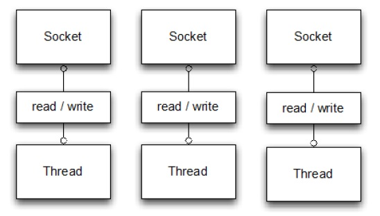
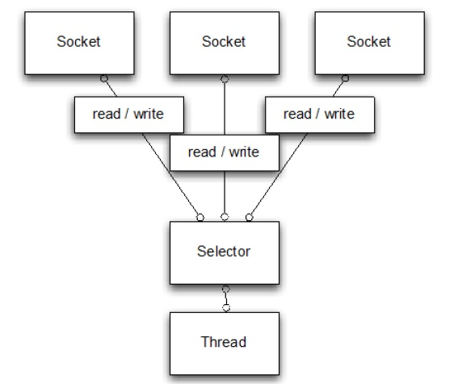

Netty-异步和数据驱动
=====

## 什么是 Netty 

Netty 是一个利用 Java 的高级网络的能力，隐藏其背后的复杂性而提供一个易于使用的 API 的客户端/服务器框架。Netty 提供高性能和可扩展性，让你可以自由地专注于你真正感兴趣的东西，你的独特的应用！

在这一章我们将解释 Netty 在处理一些高并发的网络问题体现的价值。然后，我们将介绍基本概念和构成 Netty 的工具包，我们将在这本书的其余部分深入研究。

## 一些历史

在网络发展初期，需要花很多时间来学习 socket 的复杂，寻址等等，在 C socket 库上进行编码，并需要在不同的操作系统上做不同的处理。

Java 早期版本(1995-2002)介绍了足够的面向对象的糖衣来隐藏一些复杂性，但实现复杂的客户端-服务器协议仍然需要大量的样板代码（和进行大量的监视才能确保他们是对的）。

这些早期的 Java API（java.net）只能通过原生的 socket 库来支持所谓的“blocking（阻塞）”的功能。一个简单的例子

Listing 1.1 Blocking I/O Example

    ServerSocket serverSocket = new ServerSocket(portNumber);//1
    Socket clientSocket = serverSocket.accept();             //2
    BufferedReader in = new BufferedReader(					 //3
            new InputStreamReader(clientSocket.getInputStream()));
    PrintWriter out =
            new PrintWriter(clientSocket.getOutputStream(), true);
    String request, response;
    while ((request = in.readLine()) != null) {				 //4
        if ("Done".equals(request)) {						 //5
            break;
        }
    }
    response = processRequest(request);						//6
    out.println(response);									//7
    }														//8
							
1.ServerSocket 创建并监听端口的连接请求

2.accept() 调用阻塞，直到一个连接被建立了。返回一个新的 Socket 用来处理 客户端和服务端的交互

3.流被创建用于处理 socket 的输入和输出数据。BufferedReader 读取从字符输入流里面的本文。PrintWriter 打印格式化展示的对象读到本文输出流

4.处理循环开始 readLine() 阻塞，读取字符串直到最后是换行或者输入终止。

5.如果客户端发送的是“Done”处理循环退出

6.执行方法处理请求，返回服务器的响应

7.响应发回客户端

8.处理循环继续

显然，这段代码限制每次只能处理一个连接。为了实现多个并行的客户端我们需要分配一个新的 Thread 给每个新的客户端 Socket(当然需要更多的代码)。但考虑使用这种方法来支持大量的同步，长连接。在任何时间点多线程可能处于休眠状态，等待输入或输出数据。这很容易使得资源的大量浪费，对性能产生负面影响。当然，有一种替代方案。

除了示例中所示阻塞调用，原生 socket 库同时也包含了非阻塞 I/O 的功能。这使我们能够确定任何一个 socket 中是否有数据准备读或写。我们还可以设置标志，因为读/写调用如果没有数据立即返回；就是说，如果一个阻塞被调用后就会一直阻塞，直到处理完成。通过这种方法，会带来更大的代码的复杂性成本，其实我们可以获得更多的控制权来如何利用网络资源。

## JAVA NIO

在 2002 年，Java 1.4 引入了非阻塞 API 在 java.nio 包（NIO）。

*"New"还是"Nonblocking"?*

*NIO 最初是为 New Input/Output 的缩写。然而，Java 的 API 已经存在足够长的时间，它不再是新的。现在普遍使用的缩写来表示Nonblocking I/O (非阻塞 I/O)。另一方面，一般（包括作者）指阻塞 I/O 为 OIO 或 Old
Input/Output。你也可能会遇到普通 I/O。*

我们已经展示了在 Java 的 I/O 阻塞一例例子。图 1.1 展示了方法
必须扩大到处理多个连接：给每个连接创建一个线程，有些连接是空闲的！显然，这种方法的可扩展性将是受限于可以在 JVM 中创建的线程数。

Figure 1.1 Blocking I/O

当你的应用中连接数比较少，这个方案还是可以接受。当并发连接超过10000 时，context-switching（上下文切换）开销将是明显的。此外，每个线程都有一个默认的堆栈内存分配了 128K 和 1M 之间的空间。考虑到整体的内存和操作系统需要处理 100000 个或更多的并发连接资源，这似乎是一个不理想的解决方案。

##SELECTOR

相比之下，图1.2 显示了使用非阻塞I/O，主要是消除了这些方法
约束。在这里，我们介绍了“Selector”，这是 Java 的无阻塞 I/O 实现的关键。

Figure 1.2 Nonblocking I/O

Selector 最终决定哪一组注册的 socket 准备执行 I/O。正如我们之前所解释的那样，这 I/O 操作设置为非阻塞模式。通过通知，一个线程可以同时处理多个并发连接。（一个 Selector 由一个线程通常处理，但具体实施可以使用多个线程。）因此，每次读或写操作执行能立即检查完成。总体而言，该模型提供了比 阻塞 I/O 模型 更好的资源使用，因为

* 可以用较少的线程处理更多连接，这意味着更少的开销在内存和上下文切换上
* 当没有 I/O 处理时，线程可以被重定向到其他任务上。

你可以直接用这些 Java API 构建的 NIO 建立你的应用程序，但这样做
正确和安全是无法保证的。实现可靠和可扩展的 event-processing（事件处理器）来处理和调度数据并保证尽可能有效地，这是一个繁琐和容易出错的任务，最好留给专家 - Netty。

