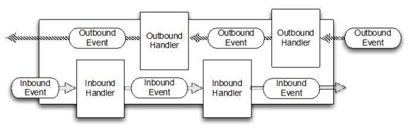

构成部分
========

正如我们前面解释的，非阻塞 I/O 不会强迫我们等待操作的完成。在这种能力的基础上，真正的异步 I/O 起到了更进一步的作用:一个异步方法完成时立即返回并直接或稍后通知用户。

正如我们将看到的,在一个网络环境的异步模型可以更有效地利用资源,可以快速连续执行多个调用。

### Channel

[Channel](http://docs.oracle.com/javase/7/docs/api/java/nio/channels/Channel.html) 是 NIO 基本的结构。它代表了一个用于连接到实体如硬件设备、文件、网络套接字或程序组件,能够执行一个或多个不同的 I/O 操作（例如读或写）的开放连接。

现在,把 Channel 想象成一个可以“打开”或“关闭”,“连接”或“断开”和作为传入和传出数据的运输工具。

### Callback (回调)

callback (回调)是一个简单的方法,提供给另一种方法作为引用,这样后者就可以在某个合适的时间调用前者。这种技术被广泛使用在各种编程的情况下,最常见的方法之一通知给其他人操作已完成。

Netty 内部使用回调处理事件时。一旦这样的回调被触发，事件可以由接口 ChannelHandler 的实现来处理。如下面的代码，一旦一个新的连接建立了,调用 channelActive(),并将打印一条消息。

Listing 1.2 ChannelHandler triggered by a callback

	public class ConnectHandler extends ChannelInboundHandlerAdapter {
	    @Override
	    public void channelActive(ChannelHandlerContext ctx) throws Exception {   //1
	        System.out.println(
	                "Client " + ctx.channel().remoteAddress() + " connected");
	    }
	}

1.当建立一个新的连接时调用 ChannelActive()

### Future

Future 提供了另外一种通知应用操作已经完成的方式。这个对象作为一个异步操作结果的占位符,它将在将来的某个时候完成并提供结果。

JDK 附带接口 java.util.concurrent.Future ,但所提供的实现只允许您手动检查操作是否完成或阻塞了。这是很麻烦的，所以 Netty 提供自己了的实现,ChannelFuture,用于在执行异步操作时使用。

ChannelFuture 提供多个附件方法来允许一个或者多个 ChannelFutureListener 实例。这个回调方法 operationComplete() 会在操作完成时调用。事件监听者能够确认这个操作是否成功或者是错误。如果是后者,我们可以检索到产生的 Throwable。简而言之, ChannelFutureListener 提供的通知机制不需要手动检查操作是否完成的。

每个 Netty 的 outbound I/O 操作都会返回一个 ChannelFuture;这样就不会阻塞。这就是 Netty 所谓的“自底向上的异步和事件驱动”。

下面例子简单的演示了作为 I/O 操作的一部分 ChannelFuture 的返回。当调用 connect() 将会直接是非阻塞的，并且调用在背后完成。由于线程是非阻塞的，所以无需等待操作完成，而可以去干其他事，因此这令资源利用更高效。

Listing 1.3 Callback in action

	Channel channel = ...;
	//不会阻塞
	ChannelFuture future = channel.connect(
	    new InetSocketAddress("192.168.0.1", 25));

1.异步连接到远程地址

下面代码描述了如何利用 ChannelFutureListener 。首先，连接到远程地址。接着，通过 ChannelFuture 调用 connect() 来 注册一个新ChannelFutureListener。当监听器被通知连接完成，我们检查状态。如果是成功，就写数据到 Channel，否则我们检索 ChannelFuture 中的Throwable。

注意，错误的处理取决于你的项目。当然,特定的错误是需要加以约束
的。例如,在连接失败的情况下你可以尝试连接到另一个。

Listing 1.4 Callback in action

	Channel channel = ...;
	//不会阻塞
    ChannelFuture future = channel.connect(			//1
            new InetSocketAddress("192.168.0.1", 25));
    future.addListener(new ChannelFutureListener() {  //2
    @Override
    public void operationComplete(ChannelFuture future) {
        if (future.isSuccess()) {					//3
            ByteBuf buffer = Unpooled.copiedBuffer(
                    "Hello", Charset.defaultCharset()); //4
            ChannelFuture wf = future.channel().writeAndFlush(buffer);				//5
            // ...
        } else {
            Throwable cause = future.cause();		//6
            cause.printStackTrace();
        }
    }
    });

1.异步连接到远程对等节点。调用立即返回并提供 ChannelFuture。

2.操作完成后通知注册一个 ChannelFutureListener 。

3.当 operationComplete() 调用时检查操作的状态。

4.如果成功就创建一个 ByteBuf 来保存数据。

5.异步发送数据到远程。再次返回ChannelFuture。

6.如果有一个错误则抛出 Throwable,描述错误原因。

### Event 和 Handler

Netty 使用不同的事件来通知我们更改的状态或操作的状态。这使我们能够根据发生的事件触发适当的行为。

这些行为可能包括：

* 日志
* 数据转换
* 流控制
* 应用程序逻辑

由于 Netty 是一个网络框架,事件很清晰的跟入站或出站数据流相关。因为一些事件可能触发传入的数据或状态的变化包括:

* 活动或非活动连接
* 数据的读取
* 用户事件
* 错误

出站事件是由于在未来操作将触发一个动作。这些包括:

* 打开或关闭一个连接到远程
* 写或冲刷数据到 socket

每个事件都可以分配给用户实现处理程序类的方法。这说明了事件驱动的范例可直接转换为应用程序构建块。

图1.3显示了一个事件可以由一连串的事件处理器来处理

Figure 1.3 Event Flow

Netty 的 ChannelHandler 是各种处理程序的基本抽象。想象下，每个处理器实例就是一个回调，用于执行对各种事件的响应。

在此基础之上，Netty 也提供了一组丰富的预定义的处理程序,您可以开箱即用。比如，各种协议的编解码器包括 HTTP 和 SSL/TLS。在内部,ChannelHandler 使用事件和 future 本身,创建具有 Netty 特性抽象的消费者。

### 整合

#### FUTURE, CALLBACK 和 HANDLER

Netty 的异步编程模型是建立在 future 和 callback 的概念上的。所有这些元素的协同为自己的设计提供了强大的力量。

拦截操作和转换入站或出站数据只需要您提供回调或利用 future 操作返回的。这使得链操作简单、高效,促进编写可重用的、通用的代码。一个 Netty 的设计的主要目标是促进“关注点分离”:你的业务逻辑从网络基础设施应用程序中分离。

#### SELECTOR, EVENT 和 EVENT LOOP

Netty 通过触发事件从应用程序中抽象出 Selector，从而避免手写调度代码。EventLoop 分配给每个 Channel 来处理所有的事件，包括

* 注册感兴趣的事件
* 调度事件到 ChannelHandler
* 安排进一步行动

该 EventLoop 本身是由只有一个线程驱动，它给一个 Channel 处理所有的 I/O 事件，并且在 EventLoop 的生命周期内不会改变。这个简单而强大的线程模型消除你可能对你的 ChannelHandler 同步的任何关注，这样你就可以专注于提供正确的回调逻辑来执行。该 API 是简单和紧凑。
