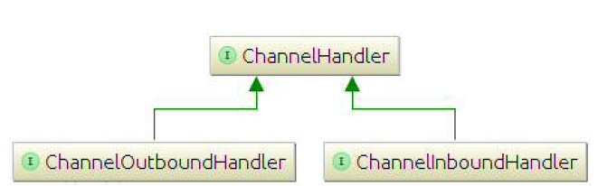
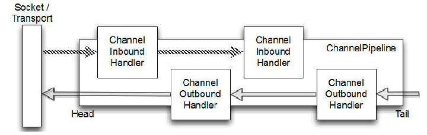

ChannelHandler 和 ChannelPipeline
=====

ChannelPipeline 是 ChannelHandler 链的容器。

在许多方面的 ChannelHandler 是在您的应用程序的核心，尽管有时它
可能并不明显。ChannelHandler 支持广泛的用途，使它难以界定。因此，最好是把它当作一个通用的容器，处理进来的事件（包括数据）并且通过ChannelPipeline。下图展示了 ChannelInboundHandler 和 ChannelOutboundHandler 继承自父接口 ChannelHandler。

Figure 3.3 ChannelHandler class hierarchy

Netty 中有两个方向的数据流，图3.4 显示的入站(ChannelInboundHandler)和出站(ChannelOutboundHandler)之间有一个明显的区别：若数据是从用户应用程序到远程主机则是“出站(outbound)”，相反若数据时从远程主机到用户应用程序则是“入站(inbound)”。

为了使数据从一端到达另一端，一个或多个 ChannelHandler 将以某种方式操作数据。这些 ChannelHandler 会在程序的“引导”阶段被添加ChannelPipeline中，并且被添加的顺序将决定处理数据的顺序。

Figure 3.4 ChannelPipeline with inbound and outbound ChannelHandlers

图 3.4 同样展示了进站和出站的处理器都可以被安装在相同的 pipeline 。本例子中，如果消息或任何其他入站事件被读到，将从 pipeline 头部开始，传递到第一个 ChannelInboundHandler。该处理器可能会或可能不会实际修改数据，取决于其特定的功能，在这之后
该数据将被传递到链中的下一个 ChannelInboundHandler。最后，将数据
到达 pipeline 的尾部，此时所有处理结束。

数据的出站运动（即，数据被“写入”）在概念上是相同的。在这种情况下的数据从尾部流过 ChannelOutboundHandlers 的链，直到它到达头部。超过这点，出站数据将到达的网络传输，在这里显示为一个 socket。通常，这将触发一个写入操作。

*更多 Inbound 、 Outbound Handler*

*在当前的链（chain）中，事件可以通过 ChanneHandlerContext 传递给下一个 handler。Netty 为此提供了抽象基类ChannelInboundHandlerAdapter 和 hannelOutboundHandlerAdapter，用来处理你想要的事件。 这些类提供的方法的实现，可以简单地通过调用 ChannelHandlerContext 上的相应方法将事件传递给下一个 handler。在实际应用中，您可以按需覆盖相应的方法即可。*

所以，如果出站和入站操作是不同的，当 ChannelPipeline 中有混合处理器时将发生什么？虽然入站和出站处理器都扩展了 ChannelHandler，Netty 的 ChannelInboundHandler 的实现
和 ChannelOutboundHandler 之间的是有区别的，从而保证数据传递只从一个处理器到下一个处理器保证正确的类型。

当 ChannelHandler 被添加到的 ChannelPipeline 它得到一个
ChannelHandlerContext，它代表一个 ChannelHandler 和 ChannelPipeline 之间的“绑定”。它通常是安全保存对此对象的引用，除了当协议中的使用的是不面向连接（例如，UDP）。而该对象可以被用来获得
底层 Channel,它主要是用来写出站数据。

还有，实际上，在 Netty 发送消息有两种方式。您可以直接写消息给
Channel 或写入 ChannelHandlerContext 对象。主要的区别是，
前一种方法会导致消息从 ChannelPipeline的尾部开始，而
后者导致消息从 ChannelPipeline 下一个处理器开始。