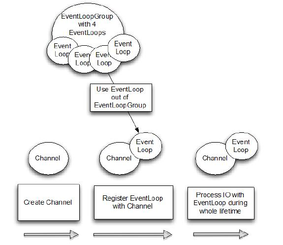

Channel, Event 和 I/O
====

Netty 是一个非阻塞、事件驱动的网络框架。Netty 实际上是使用 Threads（多线程）处理 I/O 事件，对于熟悉多线程编程的读者可能会需要关注同步代码。这样的方式不好，因为同步会影响程序的性能，Netty 的设计保证程序处理事件不会有同步。图 Figure 3.1 展示了，你不需要在 Channel 之间共享 ChannelHandler 实例的原因：

Figure 3.1 

该图显示，一个 EventLoopGroup 具有一个或多个 EventLoop。想象 EventLoop 作为一个 Thread 给 Channel 执行工作。 （事实上，一个 EventLoop 是势必为它的生命周期一个线程。）

当创建一个 Channel，Netty 通过 一个单独的 EventLoop 实例来注册该 Channel（并同样是一个单独的 Thread）的通道的使用寿命。这就是为什么你的应用程序不需要同步 Netty 的 I/O操作;所有 Channel 的 I/O
始终用相同的线程来执行。

我们将在第15章进一步讨论 EventLoop 和 EventLoopGroup。