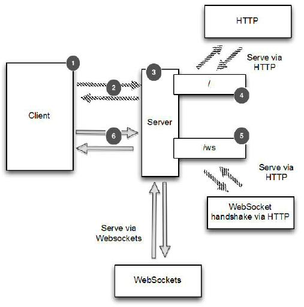
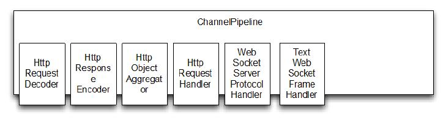
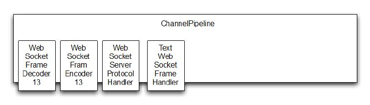

添加 WebSocket 支持
====

WebSocket 使用一种被称作“[Upgrade handshake](https://developer.mozilla.org/en-US/docs/HTTP/Protocol_upgrade_mechanism)（升级握手）”的机制将标准的 HTTP 或HTTPS 协议转为 WebSocket。因此，使用 WebSocket 的应用程序将始终以 HTTP/S 开始，然后进行升级。这种升级发生在什么时候取决于具体的应用;可以在应用启动的时候，或者当一个特定的 URL 被请求的时候。

在我们的应用中，仅当 URL 请求以“/ws”结束时，我们才升级协议为WebSocket。否则，服务器将使用基本的 HTTP/S。一旦连接升级，之后的数据传输都将使用 WebSocket 。

下面看下服务器的逻辑图

Figure 11.2 Server logic

＃1客户端/用户连接到服务器并加入聊天

＃2 HTTP 请求页面或 WebSocket 升级握手

＃3服务器处理所有客户端/用户

＃4响应 URI “/”的请求，转到 index.html

＃5如果访问的是 URI“/ws” ，处理 WebSocket 升级握手

＃6升级握手完成后 ，通过 WebSocket 发送聊天消息

###处理 HTTP 请求

本节我们将实现此应用中用于处理 HTTP 请求的组件，这个组件托管着可供客户端访问的聊天室页面，并且显示客户端发送的消息。

下面就是这个 HttpRequestHandler 的代码,它是一个用来处理 FullHttpRequest 消息的 ChannelInboundHandler 的实现类。注意看它是怎么实现忽略符合 "/ws" 格式的
URI 请求的。

Listing 11.1 HTTPRequestHandler

	public class HttpRequestHandler extends SimpleChannelInboundHandler<FullHttpRequest> {	//1
	    private final String wsUri;
	    private static final File INDEX;
	
	    static {
	        URL location = HttpRequestHandler.class.getProtectionDomain().getCodeSource().getLocation();
	        try {
	            String path = location.toURI() + "index.html";
	            path = !path.contains("file:") ? path : path.substring(5);
	            INDEX = new File(path);
	        } catch (URISyntaxException e) {
	            throw new IllegalStateException("Unable to locate index.html", e);
	        }
	    }
	
	    public HttpRequestHandler(String wsUri) {
	        this.wsUri = wsUri;
	    }
	
	    @Override
	    public void channelRead0(ChannelHandlerContext ctx, FullHttpRequest request) throws Exception {
	        if (wsUri.equalsIgnoreCase(request.getUri())) {
	            ctx.fireChannelRead(request.retain());					//2
	        } else {
	            if (HttpHeaders.is100ContinueExpected(request)) {
	                send100Continue(ctx);								//3
	            }
	
	            RandomAccessFile file = new RandomAccessFile(INDEX, "r");//4
	
	            HttpResponse response = new DefaultHttpResponse(request.getProtocolVersion(), HttpResponseStatus.OK);
	            response.headers().set(HttpHeaders.Names.CONTENT_TYPE, "text/html; charset=UTF-8");
	
	            boolean keepAlive = HttpHeaders.isKeepAlive(request);
	
	            if (keepAlive) {										//5
	                response.headers().set(HttpHeaders.Names.CONTENT_LENGTH, file.length());
	                response.headers().set(HttpHeaders.Names.CONNECTION, HttpHeaders.Values.KEEP_ALIVE);
	            }
	            ctx.write(response);					//6
	
	            if (ctx.pipeline().get(SslHandler.class) == null) {		//7
	                ctx.write(new DefaultFileRegion(file.getChannel(), 0, file.length()));
	            } else {
	                ctx.write(new ChunkedNioFile(file.getChannel()));
	            }
	            ChannelFuture future = ctx.writeAndFlush(LastHttpContent.EMPTY_LAST_CONTENT);			//8
	            if (!keepAlive) {
	                future.addListener(ChannelFutureListener.CLOSE);		//9
	            }
	        }
	    }
	
	    private static void send100Continue(ChannelHandlerContext ctx) {
	        FullHttpResponse response = new DefaultFullHttpResponse(HttpVersion.HTTP_1_1, HttpResponseStatus.CONTINUE);
	        ctx.writeAndFlush(response);
	    }
	
	    @Override
	    public void exceptionCaught(ChannelHandlerContext ctx, Throwable cause)
	            throws Exception {
	        cause.printStackTrace();
	        ctx.close();
	    }
	}

1.扩展 SimpleChannelInboundHandler 用于处理 FullHttpRequest信息

2.如果请求是一次升级了的 WebSocket 请求，则递增引用计数器（retain）并且将它传递给在  ChannelPipeline 中的下个 ChannelInboundHandler 

3.处理符合 HTTP 1.1的 "100 Continue" 请求
 
4.读取 index.html

5.判断 keepalive 是否在请求头里面

6.写 HttpResponse 到客户端

7.写 index.html 到客户端，根据 ChannelPipeline 中是否有 SslHandler 来决定使用 DefaultFileRegion 还是 ChunkedNioFile

8.写并刷新 LastHttpContent 到客户端，标记响应完成

9.如果 请求头中不包含 keepalive，当写完成时，关闭 Channel

HttpRequestHandler 做了下面几件事，

* 如果该 HTTP 请求被发送到URI “/ws”，则调用 FullHttpRequest 上的 retain()，并通过调用 fireChannelRead(msg) 转发到下一个 ChannelInboundHandler。retain() 的调用是必要的，因为 channelRead() 完成后，它会调用 FullHttpRequest 上的 release() 来释放其资源。 （请参考我们先前在第6章中关于 SimpleChannelInboundHandler 的讨论）
* 如果客户端发送的 HTTP 1.1 头是“Expect: 100-continue” ，则发送“100 Continue”的响应。
* 在 头被设置后，写一个 HttpResponse 返回给客户端。注意，这不是 FullHttpResponse，这只是响应的第一部分。另外，这里我们也不使用 writeAndFlush()， 这个是在留在最后完成。
* 如果传输过程既没有要求加密也没有要求压缩，那么把 index.html 的内容存储在一个 DefaultFileRegion 里就可以达到最好的效率。这将利用零拷贝来执行传输。出于这个原因，我们要检查 ChannelPipeline 中是否有一个 SslHandler。如果是的话，我们就使用 ChunkedNioFile。
* 写 LastHttpContent 来标记响应的结束，并终止它
* 如果不要求 keepalive ，添加 ChannelFutureListener 到 ChannelFuture 对象的最后写入，并关闭连接。注意，这里我们调用 writeAndFlush() 来刷新所有以前写的信息。

这里展示了应用程序的第一部分，用来处理纯的 HTTP 请求和响应。接下来我们将处理 WebSocket 的 frame（帧），用来发送聊天消息。

*WebSocket frame*

*WebSockets 在“帧”里面来发送数据，其中每一个都代表了一个消息的一部分。一个完整的消息可以利用了多个帧。*

###处理 WebSocket frame

WebSocket "Request for Comments" (RFC) 定义了六种不同的 frame; Netty 给他们每个都提供了一个 POJO 实现 ，见下表：

Table 11.1 WebSocketFrame types

名称 | 描述
----- | ----
BinaryWebSocketFrame  |  contains binary data
TextWebSocketFrame  | contains text data
ContinuationWebSocketFrame  | contains text or binary data that belongs to a previous BinaryWebSocketFrame or TextWebSocketFrame
CloseWebSocketFrame  | represents a CLOSE request and contains close status code and a phrase
PingWebSocketFrame  | requests the transmission of a PongWebSocketFrame
PongWebSocketFrame  | sent as a response to a PingWebSocketFrame

我们的程序只需要使用下面4个帧类型：
* CloseWebSocketFrame
* PingWebSocketFrame
* PongWebSocketFrame
* TextWebSocketFrame

在这里我们只需要处理 TextWebSocketFrame，其他的会由 WebSocketServerProtocolHandler 自动处理。

下面代码展示了 ChannelInboundHandler 处理 TextWebSocketFrame，同时也将跟踪在 ChannelGroup 中所有活动的 WebSocket 连接

Listing 11.2 Handles Text frames
	
	public class TextWebSocketFrameHandler extends SimpleChannelInboundHandler<TextWebSocketFrame> { //1
	    private final ChannelGroup group;
	
	    public TextWebSocketFrameHandler(ChannelGroup group) {
	        this.group = group;
	    }
	
	    @Override
	    public void userEventTriggered(ChannelHandlerContext ctx, Object evt) throws Exception {	//2
	        if (evt == WebSocketServerProtocolHandler.ServerHandshakeStateEvent.HANDSHAKE_COMPLETE) {
	
	            ctx.pipeline().remove(HttpRequestHandler.class);	//3
	
	            group.writeAndFlush(new TextWebSocketFrame("Client " + ctx.channel() + " joined"));//4
	
	            group.add(ctx.channel());	//5
	        } else {
	            super.userEventTriggered(ctx, evt);
	        }
	    }
	
	    @Override
	    public void channelRead0(ChannelHandlerContext ctx, TextWebSocketFrame msg) throws Exception {
	        group.writeAndFlush(msg.retain());	//6
	    }
	}
	
1.扩展 SimpleChannelInboundHandler 用于处理 TextWebSocketFrame 信息 

2.覆写userEventTriggered() 方法来处理自定义事件 

3.如果接收的事件表明握手成功,就从 ChannelPipeline 中删除HttpRequestHandler ，因为接下来不会接受 HTTP 消息了

4.写一条消息给所有的已连接 WebSocket 客户端，通知它们建立了一个新的 Channel 连接
   
5.添加新连接的 WebSocket Channel 到 ChannelGroup 中，这样它就能收到所有的信息

6.保留收到的消息，并通过  writeAndFlush() 传递给所有连接的客户端。
	
上面显示了 TextWebSocketFrameHandler 仅作了几件事：

* 当WebSocket 与新客户端已成功握手完成，通过写入信息到 ChannelGroup 中的 Channel  来通知所有连接的客户端，然后添加新 Channel 到 ChannelGroup
* 如果接收到 TextWebSocketFrame，调用 retain() ，并将其写、刷新到 ChannelGroup，使所有连接的 WebSocket Channel 都能接收到它。和以前一样，retain() 是必需的，因为当 channelRead0（）返回时，TextWebSocketFrame 的引用计数将递减。由于所有操作都是异步的，writeAndFlush() 可能会在以后完成，我们不希望它访问无效的引用。

由于 Netty 在其内部处理了其余大部分功能，唯一剩下的需要我们去做的就是为每一个新创建的 Channel 初始化 ChannelPipeline 。要完成这个，我们需要一个ChannelInitializer

###初始化 ChannelPipeline

接下来，我们需要安装我们上面实现的两个 ChannelHandler 到 ChannelPipeline。为此，我们需要继承 ChannelInitializer 并且实现 initChannel()。看下面 ChatServerInitializer  的代码实现

Listing 11.3 Init the ChannelPipeline

	public class ChatServerInitializer extends ChannelInitializer<Channel> {	//1
	    private final ChannelGroup group;
	
	    public ChatServerInitializer(ChannelGroup group) {
	        this.group = group;
	    }
	
	    @Override
	    protected void initChannel(Channel ch) throws Exception {			//2
	        ChannelPipeline pipeline = ch.pipeline();
	        pipeline.addLast(new HttpServerCodec());
	        pipeline.addLast(new HttpObjectAggregator(64 * 1024));
	        pipeline.addLast(new ChunkedWriteHandler());
	        pipeline.addLast(new HttpRequestHandler("/ws"));
	        pipeline.addLast(new WebSocketServerProtocolHandler("/ws"));
	        pipeline.addLast(new TextWebSocketFrameHandler(group));
	    }
	}

1.扩展  ChannelInitializer

2.添加 ChannelHandler　到 ChannelPipeline

initChannel() 方法用于设置所有新注册的 Channel 的ChannelPipeline,安装所有需要的 ChannelHandler。总结如下：

Table 11.2 ChannelHandlers for the WebSockets Chat server

ChannelHandler　|　职责
-------------- | ----
HttpServerCodec |Decode bytes to HttpRequest, HttpContent, LastHttpContent.Encode HttpRequest, HttpContent, LastHttpContent to bytes.
ChunkedWriteHandler | Write the contents of a file.
HttpObjectAggregator | This ChannelHandler aggregates an HttpMessage and its following HttpContents into a single FullHttpRequest or FullHttpResponse (depending on whether it is being used to handle requests or responses).With this installed the next ChannelHandler in the pipeline will receive only full HTTP requests.
HttpRequestHandler | Handle FullHttpRequests (those not sent to "/ws" URI).
WebSocketServerProtocolHandler | As required by the WebSockets specification, handle the WebSocket Upgrade handshake, PingWebSocketFrames,PongWebSocketFrames and CloseWebSocketFrames.
TextWebSocketFrameHandler | Handles TextWebSocketFrames and handshake completion events

该 WebSocketServerProtocolHandler 处理所有规定的 WebSocket 帧类型和升级握手本身。如果握手成功所需的 ChannelHandler 被添加到管道，而那些不再需要的则被去除。管道升级之前的状态如下图。这代表了 ChannelPipeline 刚刚经过 ChatServerInitializer 初始化。

Figure 11.3 ChannelPipeline before WebSockets Upgrade

握手升级成功后 WebSocketServerProtocolHandler 替换HttpRequestDecoder 为 WebSocketFrameDecoder，HttpResponseEncoder 为WebSocketFrameEncoder。 为了最大化性能，WebSocket 连接不需要的 ChannelHandler 将会被移除。其中就包括了 HttpObjectAggregator 和 HttpRequestHandler

下图，展示了 ChannelPipeline 经过这个操作完成后的情况。注意 Netty 目前支持四个版本 WebSocket 协议，每个通过其自身的方式实现类。选择正确的版本WebSocketFrameDecoder 和 WebSocketFrameEncoder 是自动进行的，这取决于在客户端（在这里指浏览器）的支持（在这个例子中，我们假设使用版本是 13 的 WebSocket 协议，从而图中显示的是 WebSocketFrameDecoder13 和 WebSocketFrameEncoder13）。

Figure 11.4 ChannelPipeline after WebSockets Upgrade

###引导

最后一步是 引导服务器，设置 ChannelInitializer

	public class ChatServer {
	
	    private final ChannelGroup channelGroup = new DefaultChannelGroup(ImmediateEventExecutor.INSTANCE);//1
	    private final EventLoopGroup group = new NioEventLoopGroup();
	    private Channel channel;
	
	    public ChannelFuture start(InetSocketAddress address) {
	        ServerBootstrap bootstrap  = new ServerBootstrap(); //2
	        bootstrap.group(group)
	                .channel(NioServerSocketChannel.class)
	                .childHandler(createInitializer(channelGroup));
	        ChannelFuture future = bootstrap.bind(address);
	        future.syncUninterruptibly();
	        channel = future.channel();
	        return future;
	    }
	
	    protected ChannelInitializer<Channel> createInitializer(ChannelGroup group) {		//3
	       return new ChatServerInitializer(group);
	    }
	
	    public void destroy() {		//4
	        if (channel != null) {
	            channel.close();
	        }
	        channelGroup.close();
	        group.shutdownGracefully();
	    }
	
	    public static void main(String[] args) throws Exception{
	        if (args.length != 1) {
	            System.err.println("Please give port as argument");
	            System.exit(1);
	        }
	        int port = Integer.parseInt(args[0]);
	
	        final ChatServer endpoint = new ChatServer();
	        ChannelFuture future = endpoint.start(new InetSocketAddress(port));
	
	        Runtime.getRuntime().addShutdownHook(new Thread() {
	            @Override
	            public void run() {
	                endpoint.destroy();
	            }
	        });
	        future.channel().closeFuture().syncUninterruptibly();
	    }
	}

1.创建  DefaultChannelGroup 用来 保存所有连接的的 WebSocket channel

2.引导 服务器

3.创建 ChannelInitializer

4.处理服务器关闭，包括释放所有资源
 