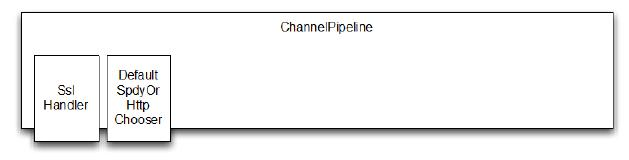
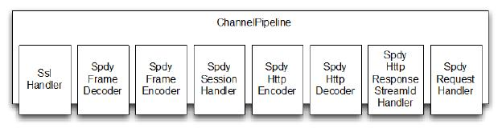
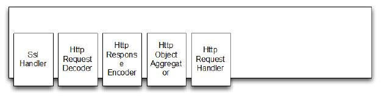

实现
====

SPDY 使用 TLS 的扩展称为 Next Protocol Negotiation (NPN)。在Java 中,我们有两种不同的方式选择的基于 NPN 的协议:
* 使用 ssl_npn,NPN 的开源 SSL 提供者。
* 使用通过 Jetty 的 NPN 扩展库。

在这个例子中使用 Jetty 库。如果你想使用 ssl_npn,请参阅<https://github.com/benmmurphy/ssl_npn>项目文档

*Jetty NPN 库*

*Jetty NPN 库是一个外部的库,而不是 Netty 的本身的一部分。它用于处理 Next Protocol Negotiation, 这是用于检测客户端是否支持 SPDY。*

###  集成 Next Protocol Negotiation  

Jetty 库提供了一个接口称为 ServerProvider,确定所使用的协议和选择哪个钩子。这个的实现可能取决于不同版本的 HTTP 和 SPDY 版本的支持。下面的清单显示了将用于我们的示例应用程序的实现。

Listing 12.1 Implementation of ServerProvider

	public class DefaultServerProvider implements NextProtoNego.ServerProvider {
	    private static final List<String> PROTOCOLS =
	            Collections.unmodifiableList(Arrays.asList("spdy/2", "spdy/3", "http/1.1"));  //1
	
	    private String protocol;
	
	    @Override
	    public void unsupported() {
	        protocol = "http/1.1";   //2
	    }
	
	    @Override
	    public List<String> protocols() {
	        return PROTOCOLS;   //3
	    }
	
	    @Override
	    public void protocolSelected(String protocol) {
	        this.protocol = protocol;  //4
	    }
	
	    public String getSelectedProtocol() {
	        return protocol;  //5
	    }
	}

1. 定义所有的 ServerProvider 实现的协议
2. 设置如果 SPDY 协议失败了就转到 http/1.1 
3. 返回支持的协议的列表
4. 设置选择的协议
5. 返回选择的协议

在 ServerProvider 的实现，我们支持下面的3种协议:

* SPDY 2
* SPDY 3
* HTTP 1.1

如果客户端不支持 SPDY ，则默认使用 HTTP 1.1

#### 实现各种 ChannelHandler

第一个 ChannelInboundHandler 是用于不支持 SPDY 的情况下处理客户端 HTTP 请求，如果不支持 SPDY 就回滚使用默认的 HTTP 协议。

清单12.2显示了HTTP流量的处理程序。

Listing 12.2 Implementation that handles HTTP

	@ChannelHandler.Sharable
	public class HttpRequestHandler extends SimpleChannelInboundHandler<FullHttpRequest> {
	    @Override
	    public void channelRead0(ChannelHandlerContext ctx, FullHttpRequest request) throws Exception { //1
	        if (HttpHeaders.is100ContinueExpected(request)) {
	            send100Continue(ctx); //2
	        }
	
	        FullHttpResponse response = new DefaultFullHttpResponse(request.getProtocolVersion(), HttpResponseStatus.OK); //3
	        response.content().writeBytes(getContent().getBytes(CharsetUtil.UTF_8));  //4
	        response.headers().set(HttpHeaders.Names.CONTENT_TYPE, "text/plain; charset=UTF-8");  //5
	
	        boolean keepAlive = HttpHeaders.isKeepAlive(request);
	
	        if (keepAlive) {  //6
	            response.headers().set(HttpHeaders.Names.CONTENT_LENGTH, response.content().readableBytes());
	            response.headers().set(HttpHeaders.Names.CONNECTION, HttpHeaders.Values.KEEP_ALIVE);
	        }
	        ChannelFuture future = ctx.writeAndFlush(response);  //7
	
	        if (!keepAlive) {
	            future.addListener (ChannelFutureListener.CLOSE); //8
	        }
	    }
	
	    protected String getContent() {  //9
	        return "This content is transmitted via HTTP\r\n";
	    }
	
	    private static void send100Continue(ChannelHandlerContext ctx) {  //10
	        FullHttpResponse response = new DefaultFullHttpResponse(HttpVersion.HTTP_1_1, HttpResponseStatus.CONTINUE);
	        ctx.writeAndFlush(response);
	    }
	
	    @Override
	    public void exceptionCaught(ChannelHandlerContext ctx, Throwable cause)
	            throws Exception {  //11
	        cause.printStackTrace();
	        ctx.close();
	    }
	}

1. 重写 channelRead0() ,可以被所有的接收到的 FullHttpRequest 调用
2. 检查如果接下来的响应是预期的，就写入
3. 新建 FullHttpResponse,用于对请求的响应
4. 生成响应的内容，将它写入 payload
5. 设置头文件，这样客户端就能知道如何与 响应的 payload 交互
6. 检查请求设置是否启用了 keepalive;如果是这样,将标题设置为符合HTTP RFC
7. 写响应给客户端，并获取到 Future 的引用，用于写完成时，获取到通知
8. 如果响应不是 keepalive，在写完成时关闭连接
9. 返回内容作为响应的 payload
10. Helper 方法生成了100 持续的响应，并写回给客户端
11. 若执行阶段抛出异常，则关闭管道

这就是 Netty 处理标准的 HTTP 。你可能需要分别处理特定　URI ,应对不同的状态代码,这取决于资源存在与否,但基本的概念将是相同的。

我们的下一个任务将会提供一个组件来支持 SPDY 作为首选协议。
Netty 提供了简单的处理 SPDY 方法。这些将使您能够重用FullHttpRequest 和 FullHttpResponse 消息，通过 SPDY 透明地接收和发送他们。

HttpRequestHandler 虽然是我们可以重用代码,我们将改变我们的内容写回客户端只是强调协议变化;通常您会返回相同的内容。下面的清单展示了实现,它扩展了先前的 HttpRequestHandler。

Listing 12.3 Implementation that handles SPDY

	@ChannelHandler.Sharable
	public class SpdyRequestHandler extends HttpRequestHandler {   //1
	    @Override
	    protected String getContent() {
	        return "This content is transmitted via SPDY\r\n";  //2
	    }
	}

1. 继承 HttpRequestHandler 这样就能共享相同的逻辑
2. 生产内容写到 payload。这个重写了 HttpRequestHandler 的
getContent() 的实现

SpdyRequestHandler 继承自 HttpRequestHandler,但区别是:写入的内容的 payload 状态的响应是在 SPDY 写的。

我们可以实现两个处理程序逻辑,将选择一个相匹配的协议。然而添加以前写过的处理程序到 ChannelPipeline 是不够的;正确的编解码器还需要补充。它的责任是检测传输字节数,然后使用 FullHttpResponse 和 FullHttpRequest 的抽象进行工作。

Netty 的附带一个基类,完全能做这个。所有您需要做的是实现逻辑选择协议和选择适当的处理程序。

清单12.4显示了实现,它使用 Netty 的提供的抽象基类。

	public class DefaultSpdyOrHttpChooser extends SpdyOrHttpChooser {
	
	    public DefaultSpdyOrHttpChooser(int maxSpdyContentLength, int maxHttpContentLength) {
	        super(maxSpdyContentLength, maxHttpContentLength);
	    }
	
	    @Override
	    protected SelectedProtocol getProtocol(SSLEngine engine) {
	        DefaultServerProvider provider = (DefaultServerProvider) NextProtoNego.get(engine);  //1
	        String protocol = provider.getSelectedProtocol();
	        if (protocol == null) {
	            return SelectedProtocol.UNKNOWN; //2
	        }
	        switch (protocol) {
	            case "spdy/2":
	                return SelectedProtocol.SPDY_2; //3
	            case "spdy/3.1":
	                return SelectedProtocol.SPDY_3_1; //4
	            case "http/1.1":
	                return SelectedProtocol.HTTP_1_1; //5
	            default:
	                return SelectedProtocol.UNKNOWN; //6
	        }
	    }
	
	    @Override
	    protected ChannelInboundHandler createHttpRequestHandlerForHttp() {
	        return new HttpRequestHandler(); //7
	    }
	
	    @Override
	    protected ChannelInboundHandler createHttpRequestHandlerForSpdy() {
	        return new SpdyRequestHandler();  //8
	    }
	}

1. 使用 NextProtoNego 用于获取 DefaultServerProvider 的引用, 用于 SSLEngine
2. 协议不能被检测到。一旦字节已经准备好读,检测过程将重新开始。
3. SPDY 2 被检测到
4. SPDY 3 被检测到
5. HTTP 1.1 被检测到
6. 未知协议被检测到
7. 将会被调用给 FullHttpRequest 消息添加处理器。该方法只会在不支持 SPDY 时调用，那么将会使用 HTTPS
8. 将会被调用给 FullHttpRequest 消息添加处理器。该方法在支持 SPDY 时调用

该实现要注意检测正确的协议并设置 ChannelPipeline 。它可以处理SPDY 版本 2、3 和 HTTP 1.1,但可以很容易地修改 SPDY 支持额外的版本。

### 设置 ChannelPipeline 

通过实现 ChannelInitializer 将所有的处理器连接到一起。正如你所了解的那样,这将设置 ChannelPipeline 并添加所有需要的ChannelHandler 的。

SPDY 需要两个 ChannelHandler:

* SslHandler,用于检测 SPDY 是否通过 TLS 扩展
* DefaultSpdyOrHttpChooser,用于当协议被检测到时，添加正确的 ChannelHandler 到 ChannelPipeline

除了添加 ChannelHandler 到 ChannelPipeline, ChannelInitializer 还有另一个责任;即,分配之前创建的 DefaultServerProvider 通过 SslHandler 到 SslEngine 。这将通过Jetty NPN 类库的 NextProtoNego helper 类实现

Listing 12.5 Implementation that handles SPDY

	public class SpdyChannelInitializer extends ChannelInitializer<SocketChannel> {  //1
	    private final SslContext context;
	
	    public SpdyChannelInitializer(SslContext context) //2 {
	        this.context = context;
	    }
	
	    @Override
	    protected void initChannel(SocketChannel ch) throws Exception {
	        ChannelPipeline pipeline = ch.pipeline();
	        SSLEngine engine = context.newEngine(ch.alloc());  //3
	        engine.setUseClientMode(false);  //4
	
	        NextProtoNego.put(engine, new DefaultServerProvider());  //5
	        NextProtoNego.debug = true;
	
	        pipeline.addLast("sslHandler", new SslHandler(engine));  //6
	        pipeline.addLast("chooser", new DefaultSpdyOrHttpChooser(1024 * 1024, 1024 * 1024));
	    }
	}

1. 继承 ChannelInitializer 是一个简单的开始
2. 传递 SSLContext 用于创建 SSLEngine
3. 新建 SSLEngine,用于新的管道和连接
4. 配置 SSLEngine 用于非客户端使用
5. 通过 NextProtoNego helper 类绑定 DefaultServerProvider 到 SSLEngine 
6. 添加 SslHandler 到 ChannelPipeline 这将会在协议检测到时保存在 ChannelPipeline
7. 添加 DefaultSpyOrHttpChooser 到 ChannelPipeline 。这个实现将会监测协议。添加正确的 ChannelHandler 到 ChannelPipeline,并且移除自身

实际的 ChannelPipeline 设置将会在 DefaultSpdyOrHttpChooser 实现之后完成,因为在这一点上它可能只需要知道客户端是否支持 SPDY

为了说明这一点,让我们总结一下,看看不同 ChannelPipeline 状态期间与客户连接的生命周期。图12.2显示了在  Channel 初始化后的 ChannelPipeline。

Figure 12.2 ChannelPipeline after connection

现在,这取决于客户端是否支持 SPDY,管道将修改DefaultSpdyOrHttpChooser 来处理协议。之后并不需要添加所需的 ChannelHandler  到 ChannelPipeline,所以删除本身。这个逻辑是由抽象 SpdyOrHttpChooser 类封装,DefaultSpdyOrHttpChooser 父类。

图12.3显示了支持 SPDY 的 ChannelPipeline 用于连接客户端的配置。

Figure 12.3 ChannelPipeline if SPDY is supported

每个 ChannelHandler 负责的一小部分工作,这个就是对基于 Netty 构造的应用程序最完美的诠释。每个 ChannelHandler 的职责如表12.3所示。

Table 12.3 Responsibilities of the ChannelHandlers when SPDY is used

名称 | 职责
----|----
SslHandler | 加解密两端交换的数据
SpdyFrameDecoder | 从接收到的 SPDY 帧中解码字节
SpdyFrameEncoder | 编码 SPDY 帧到字节
SpdySessionHandler | 处理 SPDY session
SpdyHttpEncoder | 编码 HTTP 消息到 SPDY 帧
SpdyHttpDecoder | 解码 SDPY 帧到 HTTP 消息
SpdyHttpResponseStreamIdHandler | 处理基于 SPDY ID 请求和响应之间的映射关系
SpdyRequestHandler | 处理 FullHttpRequest, 用于从 SPDY 帧中解码，因此允许 SPDY 透明传输使用

当协议是 HTTP(s) 时，ChannelPipeline 看起来相当不同,如图13.4所示。

Figure 12.3 ChannelPipeline if SPDY is not supported

和之前一样,每个 ChannelHandler 都有职责,定义在表12.4

Table 12.4 Responsibilities of the ChannelHandlers when HTTP is used

名称 | 职责
----|----
SslHandler | 加解密两端交换的数据
HttpRequestDecoder |  从接收到的 HTTP 请求中解码字节
HttpResponseEncoder | 编码 HTTP 响应到字节
HttpObjectAggregator 处理 SPDY session
HttpRequestHandler | 解码时处理 FullHttpRequest

### 所有东西组合在一起

所有的 ChannelHandler 实现已经准备好，现在组合成一个 SpdyServer

Listing 12.6 SpdyServer implementation

	public class SpdyServer {
	
	    private final NioEventLoopGroup group = new NioEventLoopGroup();  //1
	    private final SslContext context;
	    private Channel channel;
	
	    public SpdyServer(SslContext context) { //2
	        this.context = context;
	    }
	
	    public ChannelFuture start(InetSocketAddress address) {
	        ServerBootstrap bootstrap  = new ServerBootstrap(); //3
	        bootstrap.group(group)
	                .channel(NioServerSocketChannel.class)
	                .childHandler(new SpdyChannelInitializer(context)); //4
	        ChannelFuture future = bootstrap.bind(address); //5
	        future.syncUninterruptibly();
	        channel = future.channel();
	        return future;
	    }
	
	    public void destroy() { //6
	        if (channel != null) {
	            channel.close();
	        }
	        group.shutdownGracefully();
	    }
	
	    public static void main(String[] args) throws Exception {
	        if (args.length != 1) {
	            System.err.println("Please give port as argument");
	            System.exit(1);
	        }
	        int port = Integer.parseInt(args[0]);
	
	        SelfSignedCertificate cert = new SelfSignedCertificate();
	        SslContext context = SslContext.newServerContext(cert.certificate(), cert.privateKey());  //7
	        final SpdyServer endpoint = new SpdyServer(context);
	        ChannelFuture future = endpoint.start(new InetSocketAddress(port));
	
	        Runtime.getRuntime().addShutdownHook(new Thread() {
	            @Override
	            public void run() {
	                endpoint.destroy();
	            }
	        });
	        future.channel().closeFuture().syncUninterruptibly();
	    }
	}
	
1. 构建新的 NioEventLoopGroup 用于处理 I/O
2. 传递 SSLContext 用于加密
3. 新建 ServerBootstrap 用于配置服务器
4. 配置 ServerBootstrap
5. 绑定服务器用于接收指定地址的连接
6. 销毁服务器，用于关闭管道和 NioEventLoopGroup
7. 从 BogusSslContextFactory 获取 SSLContext 。这是一个虚拟实现进行测试。真正的实现将为 SslContext 配置适当的密钥存储库。