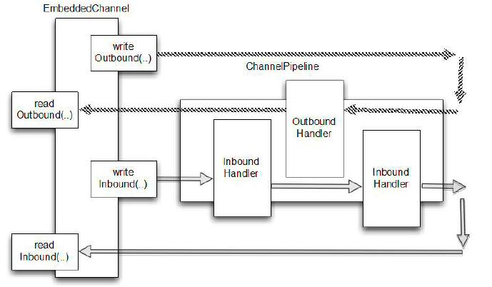

总览
====

我们已经知道,ChannelHandler 实现可以串联在一起,以构建ChannelPipeline 的处理逻辑。我们先前解释说,这个设计方法
支持潜在的复杂的分解处理成小和可重用的组件,其中每个一个定义良好的处理任务或步骤。在这一章里,我们将展示它简化了测试。

Netty 的促进 ChannelHandler 的测试通过的所谓“嵌入式”传输。这是由一个特殊 Channel 实现,EmbeddedChannel,它提供了一个简单的方法通过管道传递事件。

想法很简单:你入站或出站数据写入一个E mbeddedChannel 然后检查是否达到 ChannelPipeline 的结束。这样你可以确定消息编码或解码和ChannelHandler 是否操作被触发。

在表10.1中列出了相关方法。

名称 | 职责
----|----
writeInbound | 写一个入站消息到 EmbeddedChannel。 如果数据能从 EmbeddedChannel 通过 readInbound() 读到，则返回 true
readInbound | 从 EmbeddedChannel 读到入站消息。任何返回遍历整个ChannelPipeline。如果读取还没有准备，则此方法返回 null
writeOutbound | 写一个出站消息到 EmbeddedChannel。 如果数据能从 EmbeddedChannel 通过 readOutbound() 读到，则返回 true
readOutbound | 从 EmbeddedChannel 读到出站消息。任何返回遍历整个ChannelPipeline。如果读取还没有准备，则此方法返回 null
Finish | 如果从入站或者出站中能读到数据，标记 EmbeddedChannel 完成并且返回。这同时会调用 EmbeddedChannel 的关闭方法

*测试入站和出站数据*

*处理入站数据由 ChannelInboundHandler 处理并且表示数据从远端读取。出站数据由 ChannelOutboundHandler 处理并且表示数据写入远端。
根据 ChannelHandler 测试你会选择 writeInbound(),writeOutbound(), 或者两者都有。*

图10.1显示了数据流如何通过 ChannelPipeline 使用 EmbeddedChannel 的方法。

Figure 10.1 EmbeddedChannel data flow

如上图所示，使用 writeOutbound() 写消息到 Channel，消息在出站方法通过 ChannelPipeline，之后就可以使用 readOutbound() 读取消息。着同样使用与入站，使用 writeInbound() 和 readInbound()。处在

每种情况下,消息是通过 ChannelPipeline 并被有关ChannelInboundHandler 或 ChannelOutboundHandler 进行处理。如果消息是不消耗您可以使用 readInbound() 或 readOutbound() 适当的读到 Channel 处理后的消息。

让我们仔细看一下这两个场景,看看他们如何适用于测试您的应用程序逻辑。