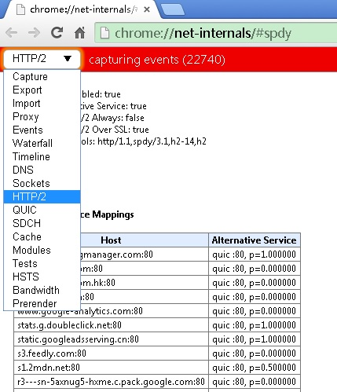
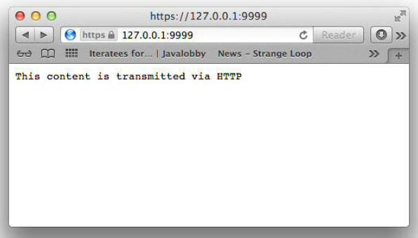

启动 SpdyServer 并测试
====

请注意,当您使用 Jetty NPN 库需要提供它的位置通过 bootclasspath 的 JVM 参数。这一步是必需的,这样才能访问 SslEngine接口。(`-Xbootclasspath` 选项允许您覆盖标准 JDK 附带的实现类)。

下面的清单显示了特殊的参数(`-Xbootclasspath`)使用。

Listing 12.7 SpdyServer implementation

	java -Xbootclasspath/p:<path_to_npn_boot_jar> ....

最简单的方式是使用 Maven 项目管理：

Listing 12.8 Compile and start SpdyServer with Maven
	
	$ mvn clean package exec:exec -Pchapter12-SpdyServer
	[INFO] Scanning for projects...
	[INFO]
	[INFO] ------------------------------------------------------------------------
	[INFO] Building netty-in-action 0.1-SNAPSHOT
	[INFO] ------------------------------------------------------------------------
	...
	...
	...
	[INFO]
	[INFO] --- maven-jar-plugin:2.4:jar (default-jar) @ netty-in-action ---
	[INFO] Building jar: /Users/norman/Documents/workspace-intellij/netty-in-actionprivate/
	target/netty-in-action-0.1-SNAPSHOT.jar
	[INFO]
	[INFO] --- exec-maven-plugin:1.2.1:exec (default-cli) @ netty-in-action ---

可以用2个浏览器进行测试，一个支持 SPDY 一个不支持，这里我们用的是 Google Chrome (支持 SPDY) 和 Safari。

浏览器访问 https://127.0.0.1:9999，会显示 SpdyRequestHandler 的处理结果，如下图

Figure 12.4 SPDY supported by Google Chrome

Google Chrome 的一个很好的功能是可以统计数据，可以很好的看到连接情况。
在浏览器中访问 chrome://net-internals/#spdy 可以看到详细的统计数据

Figure 12.5 SPDY statistics

若不支持 SPDY ，比如我们用 Safari 浏览器访问 https://127.0.0.1:9999 ，则响应将会用 HttpRequestHandler 处理

Figure 12.7 SPDY not supported by Safari

