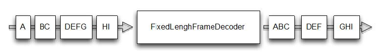

测试 ChannelHandler
====

本节，将使用 EmbeddedChannel 来测试 ChannelHandler

### 测试入站消息

我们来编写一个简单的 ByteToMessageDecoder 实现，有足够的数据可以读取时将产生固定大小的包，如果没有足够的数据可以读取，则会等待下一个数据块并再次检查是否可以产生一个完整包。
        
如图所示，它可能会占用一个以上的“event”以获取足够的字节产生一个数据包，并将它传递到 ChannelPipeline 中的下一个 ChannelHandler，

Figure 10.2 Decoding via FixedLengthFrameDecoder

实现如下：

Listing 10.1 FixedLengthFrameDecoder implementation

	public class FixedLengthFrameDecoder extends ByteToMessageDecoder { //1
	
	    private final int frameLength;
	
	    public FixedLengthFrameDecoder(int frameLength) { //2
	        if (frameLength <= 0) {
	            throw new IllegalArgumentException(
	                    "frameLength must be a positive integer: " + frameLength);
	        }
	        this.frameLength = frameLength;
	    }
	
	    @Override
	    protected void decode(ChannelHandlerContext ctx, ByteBuf in, List<Object> out) throws Exception {
	        if (in.readableBytes() >= frameLength) { //3
	            ByteBuf buf = in.readBytes(frameLength);//4
	            out.add(buf); //5
	        }
	    }
	}

1. 继承 ByteToMessageDecoder 用来处理入站的字节并将他们解码为消息
2. 指定产出的帧的长度
3. 检查是否有足够的字节用于读到下个帧
4. 从 ByteBuf 读取新帧
5. 添加帧到解码好的消息 List 

下面是单元测试的例子，使用 EmbeddedChannel

Listing 10.2 Test the FixedLengthFrameDecoder

	public class FixedLengthFrameDecoderTest {
	
	    @Test    //1
	    public void testFramesDecoded() {
	        ByteBuf buf = Unpooled.buffer(); //2
	        for (int i = 0; i < 9; i++) {
	            buf.writeByte(i);
	        }
	        ByteBuf input = buf.duplicate();
	
	        EmbeddedChannel channel = new EmbeddedChannel(new FixedLengthFrameDecoder(3)); //3
	        Assert.assertFalse(channel.writeInbound(input.readBytes(2))); //4
	        Assert.assertTrue(channel.writeInbound(input.readBytes(7)));
	
	        Assert.assertTrue(channel.finish());  //5
	        ByteBuf read = (ByteBuf) channel.readInbound();
	        Assert.assertEquals(buf.readSlice(3), read);
	        read.release();
	
	        read = (ByteBuf) channel.readInbound();
	        Assert.assertEquals(buf.readSlice(3), read);
	        read.release();
	
	        read = (ByteBuf) channel.readInbound();
	        Assert.assertEquals(buf.readSlice(3), read);
	        read.release();
	
	        Assert.assertNull(channel.readInbound());
	        buf.release();
	    }
	
	
	    @Test
	    public void testFramesDecoded2() {
	        ByteBuf buf = Unpooled.buffer();
	        for (int i = 0; i < 9; i++) {
	            buf.writeByte(i);
	        }
	        ByteBuf input = buf.duplicate();
	
	        EmbeddedChannel channel = new EmbeddedChannel(new FixedLengthFrameDecoder(3));
	        Assert.assertFalse(channel.writeInbound(input.readBytes(2)));
	        Assert.assertTrue(channel.writeInbound(input.readBytes(7)));
	
	        Assert.assertTrue(channel.finish());
	        ByteBuf read = (ByteBuf) channel.readInbound();
	        Assert.assertEquals(buf.readSlice(3), read);
	        read.release();
	
	        read = (ByteBuf) channel.readInbound();
	        Assert.assertEquals(buf.readSlice(3), read);
	        read.release();
	
	        read = (ByteBuf) channel.readInbound();
	        Assert.assertEquals(buf.readSlice(3), read);
	        read.release();
	
	        Assert.assertNull(channel.readInbound());
	        buf.release();
	    }
	}

1. 测试增加 @Test 注解
2. 新建 ByteBuf 并用字节填充它
3. 新增 EmbeddedChannel 并添加 FixedLengthFrameDecoder 用于测试
4. 写数据到 EmbeddedChannel
5. 标记 channel 已经完成
6. 读产生的消息并且校验

如上面代码，testFramesDecoded() 方法想测试一个 ByteBuf，这个ByteBuf 包含9个可读字节，被解码成包含了3个可读字节的 ByteBuf。你可能注意到，它写入9字节到通道是通过调用 writeInbound() 方法，之后再执行 finish() 来将 EmbeddedChannel 标记为已完成，最后调用readInbound() 方法来获取 EmbeddedChannel 中的数据，直到没有可读字节。testFramesDecoded2() 方法采取同样的方式，但有一个区别就是入站ByteBuf分两步写的，当调用 writeInbound(input.readBytes(2)) 后返回 false 时，FixedLengthFrameDecoder 值会产生输出，至少有3个字节是可读，testFramesDecoded2() 测试的工作相当于testFramesDecoded()。

### Testing outbound messages 

测试的处理出站消息类似于我们刚才看到的一切。这个例子将使用的实现MessageToMessageEncoder:AbsIntegerEncoder。
* 当收到 flush() 它将从 ByteBuf 读取4字节整数并给每个执行Math.abs()。
* 每个整数接着写入 ChannelHandlerPipeline

图10.3显示了逻辑。

Figure 10.3 Encoding via AbsIntegerEncoder

示例如下：

Listing 10.3 AbsIntegerEncoder

	public class AbsIntegerEncoder extends MessageToMessageEncoder<ByteBuf> {  //1
	    @Override
	    protected void encode(ChannelHandlerContext channelHandlerContext, ByteBuf in, List<Object> out) throws Exception {
	        while (in.readableBytes() >= 4) { //2
	            int value = Math.abs(in.readInt());//3
	            out.add(value);  //4
	        }
	    }
	}

1. 继承 MessageToMessageEncoder 用于编码消息到另外一种格式
2. 检查是否有足够的字节用于编码
3. 读取下一个输入 ByteBuf 产出的  int 值，并计算绝对值
4. 写 int 到编码的消息 List 

在前面的示例中,我们将使用 EmbeddedChannel 测试代码。清单10.4

Listing 10.4 Test the AbsIntegerEncoder

	public class AbsIntegerEncoderTest {
	
	    @Test   //1
	    public void testEncoded() {
	        ByteBuf buf = Unpooled.buffer();  //2
	        for (int i = 1; i < 10; i++) {
	            buf.writeInt(i * -1);
	        }
	
	        EmbeddedChannel channel = new EmbeddedChannel(new AbsIntegerEncoder());  //3
	        Assert.assertTrue(channel.writeOutbound(buf)); //4
	
	        Assert.assertTrue(channel.finish()); //5
	        for (int i = 1; i < 10; i++) {
	            Assert.assertEquals(i, channel.readOutbound());  //6
	        }
	        Assert.assertNull(channel.readOutbound());
	    }
	}

1. 用 @Test 标记
2. 新建 ByteBuf 并写入负整数
3. 新建 EmbeddedChannel 并安装 AbsIntegerEncoder 来测试
4. 写 ByteBuf 并预测 readOutbound() 产生的数据
5. 标记 channel 已经完成
6. 读取产生到的消息，检查负值已经编码为绝对值