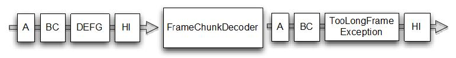

测试异常处理
====

有时候传输的入站或出站数据不够，通常这种情况也需要处理，例如抛出一个异常。这可能是你错误的输入或处理大的资源或其他的异常导致。我们来写一个实现，如果输入字节超出限制长度就抛出TooLongFrameException，这样的功能一般用来防止资源耗尽。看下图：

在图10.4最大帧大小被设置为3个字节。

Figure 10.4 Decoding via FrameChunkDecoder

上图显示帧的大小被限制为3字节，若输入的字节超过3字节，则超过的字节被丢弃并抛出 TooLongFrameException。在 ChannelPipeline 中的其他ChannelHandler 实现可以处理 TooLongFrameException 或者忽略异常。处理异常在 ChannelHandler.exceptionCaught() 方法中完成，ChannelHandler 提供了一些具体的实现，看下面代码：

	public class FrameChunkDecoder extends ByteToMessageDecoder {  //1
	
	    private final int maxFrameSize;
	
	    public FrameChunkDecoder(int maxFrameSize) {
	        this.maxFrameSize = maxFrameSize;
	    }
	
	    @Override
	    protected void decode(ChannelHandlerContext ctx, ByteBuf in, List<Object> out) throws Exception {
	        int readableBytes = in.readableBytes();  //2
	        if (readableBytes > maxFrameSize)  {
	            // discard the bytes   //3
	            in.clear();
	            throw new TooLongFrameException();
	        }
	        ByteBuf buf = in.readBytes(readableBytes); //4
	        out.add(buf);  //5
	    }
	}

1. 继承 ByteToMessageDecoder 用于解码入站字节到消息
2. 指定最大需要的帧产生的体积
3. 如果帧太大就丢弃并抛出一个 TooLongFrameException 异常
4. 同时从 ByteBuf 读到新帧
5. 添加帧到解码消息 List

示例如下：

Listing 10.6 Testing FixedLengthFrameDecoder

	public class FrameChunkDecoderTest {
	
	    @Test    //1
	    public void testFramesDecoded() {
	        ByteBuf buf = Unpooled.buffer();  //2
	        for (int i = 0; i < 9; i++) {
	            buf.writeByte(i);
	        }
	        ByteBuf input = buf.duplicate();
	
	        EmbeddedChannel channel = new EmbeddedChannel(new FrameChunkDecoder(3));  //3
	        Assert.assertTrue(channel.writeInbound(input.readBytes(2)));  //4
	        try {
	            channel.writeInbound(input.readBytes(4)); //5
	            Assert.fail();  //6
	        } catch (TooLongFrameException e) {
	            // expected
	        }
	        Assert.assertTrue(channel.writeInbound(input.readBytes(3)));  //7
	
	
	        Assert.assertTrue(channel.finish());  //8
	
	        ByteBuf read = (ByteBuf) channel.readInbound();
	        Assert.assertEquals(buf.readSlice(2), read); //9
	        read.release();
	
	        read = (ByteBuf) channel.readInbound();
	        Assert.assertEquals(buf.skipBytes(4).readSlice(3), read);
	        read.release();
	
	        buf.release();
	    }
	}
	
1. 使用 @Test 注解
2. 新建 ByteBuf 写入 9 个字节
3. 新建 EmbeddedChannel 并安装一个 FixedLengthFrameDecoder 用于测试
4. 写入 2 个字节并预测生产的新帧(消息)
5. 写一帧大于帧的最大容量 (3) 并检查一个 TooLongFrameException 异常
6. 如果异常没有被捕获，测试将失败。注意如果类实现 exceptionCaught() 并且处理了异常 exception，那么这里就不会捕捉异常
7. 写剩余的 2 个字节预测一个帧
8. 标记 channel 完成
9. 读到的产生的消息并且验证值。注意 assertEquals(Object,Object)测试使用 equals() 是否相当，不是对象的引用是否相当

即使我们使用 EmbeddedChannel 和 ByteToMessageDecoder。

应该指出的是,同样的可以做每个 ChannelHandler 的实现,将抛出一个异常。

乍一看,这看起来很类似于测试我们写在清单10.2中,但它有一个有趣的转折,即 TooLongFrameException 的处理。这里使用的 try/catch 块是 EmbeddedChannel 的一种特殊的特性。如果其中一个“write*"编写方法产生一个受控异常将被包装在一个 RuntimeException。这使得测试更加容易,如果异常处理的一部分处理。

