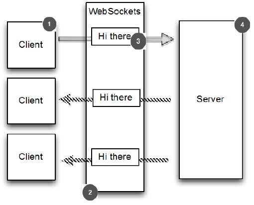

WebSocket 程序示例
====

为了说明实时功能的特点，我们使用 WebSocket 协议来实现一个基于浏览器的实时聊天程序，就像你在 Facebook 中用文字聊天一样。但是我们这里要更进一步，我们要让不同的用户可以同时互相交谈。

程序逻辑如图 11.1 所示

＃1客户端/用户连接到服务器，并且是聊天的一部分

＃2聊天消息通过 WebSocket 进行交换

＃3消息双向发送

＃4服务器处理所有的客户端/用户

逻辑很简单：

* 1.客户端发送一个消息。
* 2.消息被广播到所有其他连接的客户端。

这正如你所想的聊天室的工作方式：每个人都可以跟其他人聊天。此例子将仅提供服务器端，浏览器充当客户端，通过访问网页来聊天。正如您接下来要看到的，WebSocket 让这一切变得简单。

