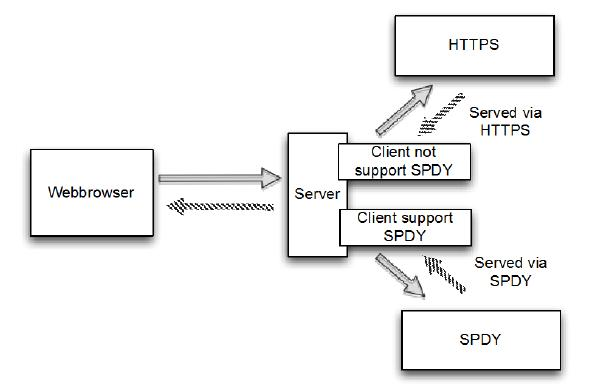

示例程序
====

编写一个简单的服务器应用程序,向您展示如何将 SPDY 集成到你的下一个应用程序。它只会提供一些静态内容回客户机。这些内容将取决于所使用协议是 HTTPS 或 SPDY 。如果 服务器提供 SPDY 是可以被客户端浏览器所支持，则自动切换到 SPDY 。图12.1显示了应用程序的流程

对于这个应用程序只编写一个服务器组件处理 HTTPS 和 SPDY。为了演示其功能使用两个不同的 web 浏览器,一个支持 SPDY,另外一个不支持。