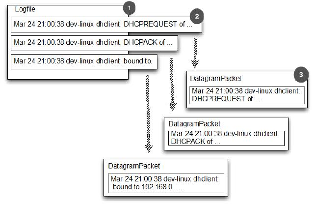
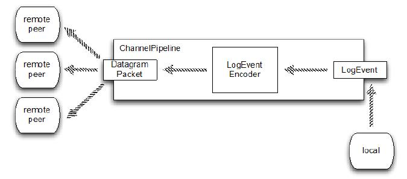

写广播器
====

本节，我们将写一个广播器。下图展示了广播一个 DatagramPacket 在每个日志实体里面的方法

1. 日志文件
2. 日志文件中的日志实体
3. 一个 DatagramPacket 保持一个单独的日志实体 

Figure 13.2 Log entries sent with DatagramPackets

图13.3表示一个 LogEventBroadcaster 的 ChannelPipeline 的高级视图,说明了 LogEvent 是如何流转的。

Figure 13.3 LogEventBroadcaster: ChannelPipeline and LogEvent flow

正如我们所看到的,所有的数据传输都封装在 LogEvent 消息里。LogEventBroadcaster 写这些通过在本地端的管道,发送它们通过ChannelPipeline 转换(编码)为一个定制的 ChannelHandler  的DatagramPacket 信息。最后,他们通过 UDP 广播并被远程接收。

*编码器和解码器*

*编码器和解码器将消息从一种格式转换为另一种,深度探讨在第7章中进行。我们探索 Netty 提供的基础类来简化和实现自定义 ChannelHandler 如 LogEventEncoder 在这个应用程序中。*

下面展示了 编码器的实现

Listing 13.2 LogEventEncoder

	public class LogEventEncoder extends MessageToMessageEncoder<LogEvent> {
	    private final InetSocketAddress remoteAddress;
	
	    public LogEventEncoder(InetSocketAddress remoteAddress) {  //1
	        this.remoteAddress = remoteAddress;
	    }
	
	    @Override
	    protected void encode(ChannelHandlerContext channelHandlerContext, LogEvent logEvent, List<Object> out) throws Exception {
	        byte[] file = logEvent.getLogfile().getBytes(CharsetUtil.UTF_8); //2
	        byte[] msg = logEvent.getMsg().getBytes(CharsetUtil.UTF_8);
	        ByteBuf buf = channelHandlerContext.alloc().buffer(file.length + msg.length + 1);
	        buf.writeBytes(file);
	        buf.writeByte(LogEvent.SEPARATOR); //3
	        buf.writeBytes(msg);  //4
	        out.add(new DatagramPacket(buf, remoteAddress));  //5
	    }
	}

1. LogEventEncoder 创建了 DatagramPacket 消息类发送到指定的 
InetSocketAddress
2. 写文件名到  ByteBuf
3. 添加一个 SEPARATOR
4. 写一个日志消息到 ByteBuf
5. 添加新的 DatagramPacket 到出站消息

*为什么使用 MessageToMessageEncoder?*

*当然我们可以编写自己的自定义 ChannelOutboundHandler  来转换 LogEvent 对象到 DatagramPackets。但是继承自MessageToMessageEncoder 为我们简化和做了大部分的工作。*

为了实现 LogEventEncoder，我们只需要定义服务器的运行时配置,我们称之为“bootstrapping（引导）”。这包括设置各种 ChannelOption 并安装需要的 ChannelHandler 到 ChannelPipeline  中。完成的
LogEventBroadcaster 类,如清单13.3所示。

Listing 13.3 LogEventBroadcaster

	public class LogEventBroadcaster {
	    private final Bootstrap bootstrap;
	    private final File file;
	    private final EventLoopGroup group;
	
	    public LogEventBroadcaster(InetSocketAddress address, File file) {
	        group = new NioEventLoopGroup();
	        bootstrap = new Bootstrap();
	        bootstrap.group(group)
	                .channel(NioDatagramChannel.class)
	                .option(ChannelOption.SO_BROADCAST, true)
	                .handler(new LogEventEncoder(address)); //1
	
	        this.file = file;
	    }
	
	    public void run() throws IOException {
	        Channel ch = bootstrap.bind(0).syncUninterruptibly().channel(); //2
	        System.out.println("LogEventBroadcaster running");
	        long pointer = 0;
	        for (;;) {
	            long len = file.length(); 
	            if (len < pointer) {
	                // file was reset
	                pointer = len; //3
	            } else if (len > pointer) {
	                // Content was added
	                RandomAccessFile raf = new RandomAccessFile(file, "r");
	                raf.seek(pointer);  //4
	                String line;
	                while ((line = raf.readLine()) != null) {
	                    ch.writeAndFlush(new LogEvent(null, -1, file.getAbsolutePath(), line));  //5
	                }
	                pointer = raf.getFilePointer(); //6
	                raf.close();
	            }
	            try {
	                Thread.sleep(1000);  //7
	            } catch (InterruptedException e) {
	                Thread.interrupted();
	                break;
	            }
	        }
	    }
	
	    public void stop() {
	        group.shutdownGracefully();
	    }
	
	    public static void main(String[] args) throws Exception {
	        if (args.length != 2) {
	            throw new IllegalArgumentException();
	        }
	
	        LogEventBroadcaster broadcaster = new LogEventBroadcaster(new InetSocketAddress("255.255.255.255",
	                Integer.parseInt(args[0])), new File(args[1]));  //8
	        try {
	            broadcaster.run();
	        } finally {
	            broadcaster.stop();
	        }
	    }
	}

1. 引导 NioDatagramChannel 。为了使用广播，我们设置 SO_BROADCAST 的 socket 选项
2. 绑定管道。注意当使用 Datagram Channel 时，是没有连接的
3. 如果需要，可以设置文件的指针指向文件的最后字节
4. 设置当前文件的指针，这样不会把旧的发出去
5. 写一个 LogEvent 到管道用于保存文件名和文件实体。(我们期望每个日志实体是一行长度)
6. 存储当前文件的位置，这样，我们可以稍后继续
7. 睡 1 秒。如果其他中断退出循环就重新启动它。
8. 构造一个新的实例 LogEventBroadcaster 并启动它

这就是程序的完整的第一部分。可以使用 "netcat" 程序查看程序的结果。在 UNIX/Linux 系统，可以使用 "nc", 在 Windows 环境下，可以在 <http://nmap.org/ncat>找到

Netcat 是完美的第一个测试我们的应用程序;它只是监听指定的端口上接收并打印所有数据到标准输出。将其设置为在端口 9999 上监听 UDP 数据如下:

	$ nc -l -u 9999

现在我们需要启动 LogEventBroadcaster。清单13.4显示了如何使用 mvn 编译和运行广播器。pom的配置。pom.xml 配置指向一个文件`/var/log/syslog`(假设是UNIX / Linux环境)和端口设置为 9999。文件中的条目将通过 UDP 广播到端口，在你开始 netcat 后打印到控制台。

Listing 13.4 Compile and start the LogEventBroadcaster
	
	$ mvn clean package exec:exec -Pchapter13-LogEventBroadcaster
	[INFO] Scanning for projects...
	[INFO]
	[INFO] --------------------------------------------------------------------
	[INFO] Building netty-in-action 0.1-SNAPSHOT
	[INFO] --------------------------------------------------------------------
	...
	...
	[INFO]
	[INFO] --- maven-jar-plugin:2.4:jar (default-jar) @ netty-in-action ---
	[INFO] Building jar: /Users/norman/Documents/workspace-intellij/netty-in-actionprivate/
	target/netty-in-action-0.1-SNAPSHOT.jar
	[INFO]
	[INFO] --- exec-maven-plugin:1.2.1:exec (default-cli) @ netty-in-action -
	LogEventBroadcaster running

当调用 mvn 时，在系统属性中改变文件和端口值,指定你想要的。清单13.5 设置日志文件 到 `/var/log/mail.log` 和端口 8888。

Listing 13.5 Compile and start the LogEventBroadcaster

	$ mvn clean package exec:exec -Pchapter13-LogEventBroadcaster /
	-Dlogfile=/var/log/mail.log -Dport=8888 -....
	....
	[INFO]
	[INFO] --- exec-maven-plugin:1.2.1:exec (default-cli) @ netty-in-action -
	LogEventBroadcaster running

当看到 “LogEventBroadcaster running” 说明程序运行成功了。

netcat 只用于测试，但不适合生产环境中使用。

