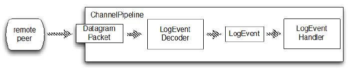

写监视器
====

这一节我们编写一个监视器：EventLogMonitor ，也就是用来接收事件的程序，用来代替 netcat 。EventLogMonitor 做下面事情：

* 接收 LogEventBroadcaster 广播的 UDP DatagramPacket
* 解码 LogEvent 消息
* 输出 LogEvent 消息

和之前一样,将实现自定义 ChannelHandler 的逻辑。图13.4描述了LogEventMonitor 的 ChannelPipeline 并表明了 LogEvent 的流经情况。

Figure 13.4 LogEventMonitor

图中显示我们的两个自定义 ChannelHandlers,LogEventDecoder  和 LogEventHandler。首先是负责将网络上接收到的 DatagramPacket 解码到 LogEvent 消息。清单13.6显示了实现。

Listing 13.6 LogEventDecoder

	public class LogEventDecoder extends MessageToMessageDecoder<DatagramPacket> {
	    @Override
	    protected void decode(ChannelHandlerContext ctx, DatagramPacket datagramPacket, List<Object> out) throws Exception {
	        ByteBuf data = datagramPacket.content(); //1
	        int i = data.indexOf(0, data.readableBytes(), LogEvent.SEPARATOR);  //2
	        String filename = data.slice(0, i).toString(CharsetUtil.UTF_8);  //3
	        String logMsg =  data.slice(i + 1, data.readableBytes()).toString(CharsetUtil.UTF_8);  //4
	
	        LogEvent event = new LogEvent(datagramPacket.recipient(), System.currentTimeMillis(),
	                filename,logMsg); //5
	        out.add(event);
	    }
	}

1. 获取 DatagramPacket 中数据的引用
2. 获取 SEPARATOR 的索引
3. 从数据中读取文件名
4. 读取数据中的日志消息
5. 构造新的 LogEvent 对象并将其添加到列表中

第二个 ChannelHandler 将执行一些首先创建的 LogEvent 消息。在这种情况下,我们只会写入 system.out。在真实的应用程序可能用到一个单独的日志文件或放到数据库。

下面的清单显示了 LogEventHandler。

Listing 13.7 LogEventHandler

	public class LogEventHandler extends SimpleChannelInboundHandler<LogEvent> { //1
	
	    @Override
	    public void exceptionCaught(ChannelHandlerContext ctx, Throwable cause) throws Exception {
	        cause.printStackTrace(); //2
	        ctx.close();
	    }
	
	    @Override
	    public void channelRead0(ChannelHandlerContext channelHandlerContext, LogEvent event) throws Exception {
	        StringBuilder builder = new StringBuilder(); //3
	        builder.append(event.getReceivedTimestamp());
	        builder.append(" [");
	        builder.append(event.getSource().toString());
	        builder.append("] [");
	        builder.append(event.getLogfile());
	        builder.append("] : ");
	        builder.append(event.getMsg());
	
	        System.out.println(builder.toString()); //4
	    }
	}

1. 继承 SimpleChannelInboundHandler 用于处理 LogEvent 消息
2. 在异常时，输出消息并关闭 channel
3. 建立一个 StringBuilder 并构建输出
4. 打印出 LogEvent 的数据

LogEventHandler 打印出 LogEvent 的一个易读的格式,包括以下:

* 收到时间戳以毫秒为单位
* 发送方的 InetSocketAddress,包括IP地址和端口
* LogEvent 生成绝对文件名
* 实际的日志消息,代表在日志文件中一行

现在我们需要安装处理程序到 ChannelPipeline ，如图13.4所示。下一个清单显示了这是如何实现 LogEventMonitor 类的一部分。

Listing 13.8 LogEventMonitor

	public class LogEventMonitor {
	
	    private final Bootstrap bootstrap;
	    private final EventLoopGroup group;
	    public LogEventMonitor(InetSocketAddress address) {
	        group = new NioEventLoopGroup();
	        bootstrap = new Bootstrap();
	        bootstrap.group(group)  //1
	                .channel(NioDatagramChannel.class)
	                .option(ChannelOption.SO_BROADCAST, true)
	                .handler(new ChannelInitializer<Channel>() {
	                    @Override
	                    protected void initChannel(Channel channel) throws Exception {
	                        ChannelPipeline pipeline = channel.pipeline();
	                        pipeline.addLast(new LogEventDecoder());  //2
	                        pipeline.addLast(new LogEventHandler());
	                    }
	                }).localAddress(address);
	
	    }
	
	    public Channel bind() {
	        return bootstrap.bind().syncUninterruptibly().channel();  //3
	    }
	
	    public void stop() {
	        group.shutdownGracefully();
	    }
	
	    public static void main(String[] args) throws Exception {
	        if (args.length != 1) {
	            throw new IllegalArgumentException("Usage: LogEventMonitor <port>");
	        }
	        LogEventMonitor monitor = new LogEventMonitor(new InetSocketAddress(Integer.parseInt(args[0])));  //4
	        try {
	            Channel channel = monitor.bind();
	            System.out.println("LogEventMonitor running");
	
	            channel.closeFuture().await();
	        } finally {
	            monitor.stop();
	        }
	    }
	}

1. 引导 NioDatagramChannel。设置 SO_BROADCAST socket 选项。
2. 添加 ChannelHandler 到 ChannelPipeline
3. 绑定的通道。注意,在使用 DatagramChannel 是没有连接，因为这些
无连接
4. 构建一个新的 LogEventMonitor

