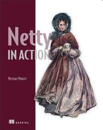

# Essential Netty in Action 《Netty 实战(精髓)》

It is a book about the Essentials of Norman Maurer's [Netty in Action](http://manning.com/maurer/)(base on MEAP v10). Through this book, you can quickly start with Netty. This is a GitBook version of the book: <http://waylau.gitbooks.io/essential-netty-in-action/>
Let's [READ](SUMMARY.md)!

《Netty 实战(精髓)》是对 Norman Maurer 的 《[Netty in Action](http://manning.com/maurer/)》(基于 MEAP v10)的一个中文精简。取其精华，去其糟粕，带你快速掌握 Netty ，插入配图，图文并茂方便用户理解。本书利用业余时间编写,由于时间紧凑,精力和能力有限,书中未免有纰漏和错误,望读者能够热忱斧正。

对于初学者，也推荐参阅《[Netty 4.x 用户指南](https://github.com/waylau/netty-4-user-guide)》。与之类似的 NIO 框架还有 MINA, 可参阅《[Apache MINA 2 用户指南](https://github.com/waylau/apache-mina-2.x-user-guide)》

## 关于开源

本项目是针对当前市面上缺乏 Netty 的相关的参考资料而产生的，广大 Netty 爱好者通过开源方式来学习交流 Netty，推动 [Netty 社区](http://netty.io/)的繁荣。

当然，广大开发者需认识到，开源不等于免费，对于原著的版权，仍应抱有敬意。请支持原著！

## 如何开始阅读

选择下面入口之一：

* <https://github.com/waylau/essential-netty-in-action/> 的 [SUMMARY.md](SUMMARY.md)（源码）
* <http://waylau.gitbooks.io/essential-netty-in-action/> 点击 Read 按钮（同步更新，国内访问速度一般）
* <https://waylau.com/essential-netty-in-action/>（国内访问速度快，定期更新。最后更新于 2016-2-16）

## 意见、建议

如有勘误、意见或建议欢迎拍砖 <https://github.com/waylau/essential-netty-in-action/issues>

## 联系作者:

您也可以直接联系我：

* 博客：https://waylau.com
* 邮箱：[waylau521(at)gmail.com](mailto:waylau521@gmail.com)
* 微博：http://weibo.com/waylau521
* 开源：https://github.com/waylau

## 其他书籍

若您对本书不感冒，笔者还写了其他方面的超过一打的书籍（可见<https://waylau.com/books/>），多是开源电子书。

本人也维护了一个[books-collection](https://github.com/waylau/books-collection)项目，里面提供了优质的专门给程序员的开源、免费图书集合。

## 开源捐赠

捐赠所得所有款项将用于开源事业！
